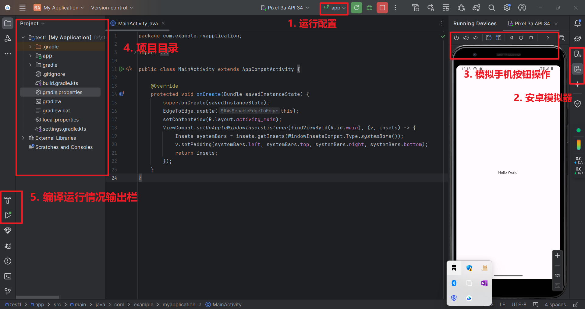
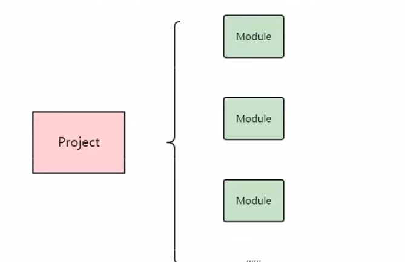
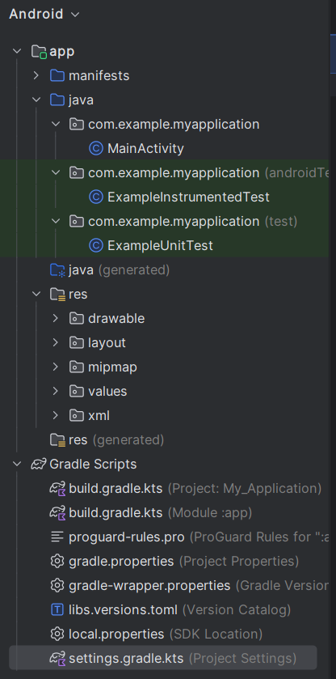
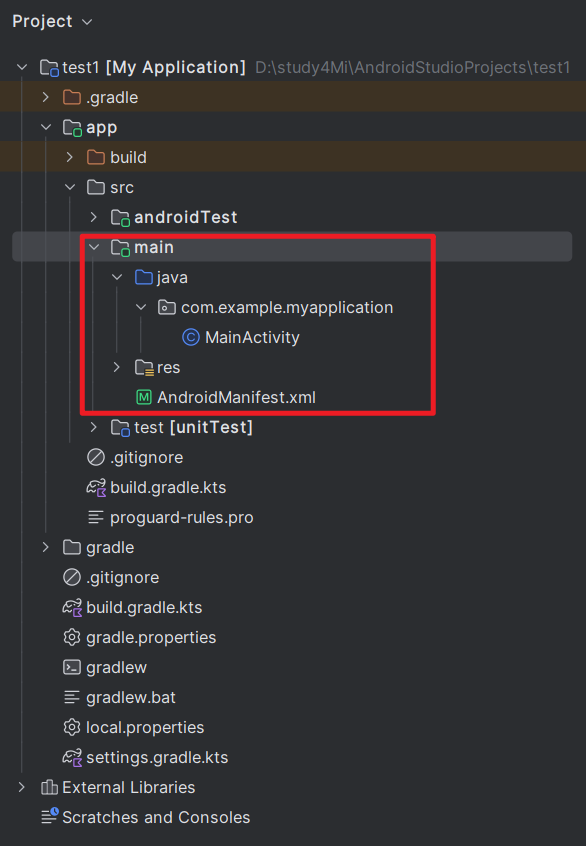
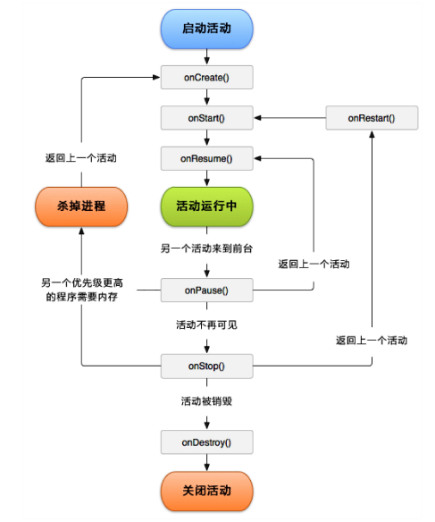
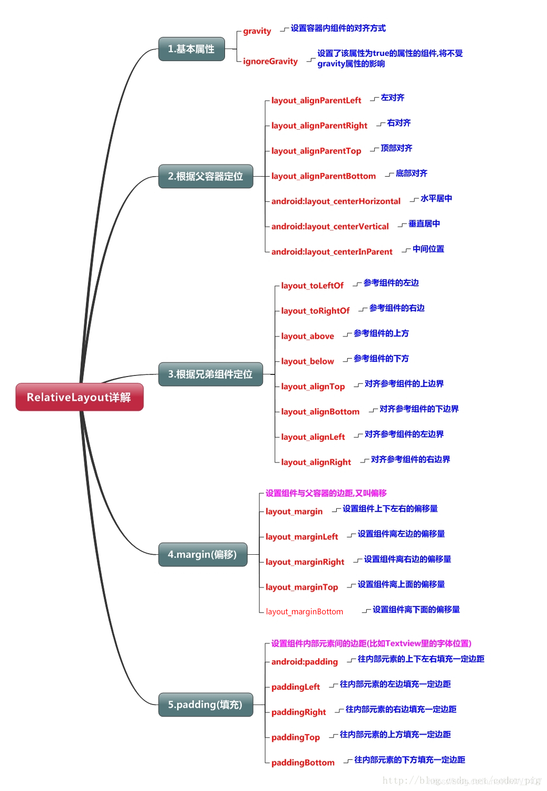
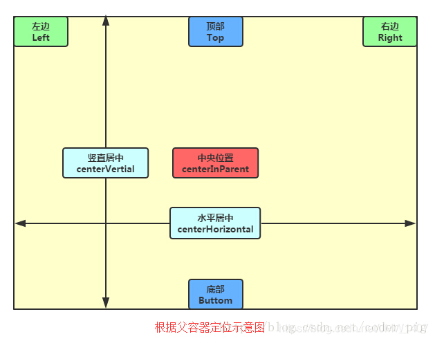
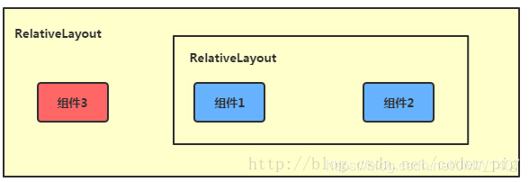

# 安卓开发
[TOC]

## 0. 前言
目前还不错的博客：
[环境搭建和日志使用](https://blog.csdn.net/yang2330648064/article/details/129008294)
[开源安卓项目教程](https://blog.csdn.net/weixin_43853746/article/details/117367078)
[适合简洁快速的查找相关组件使用](https://www.twle.cn/l/yufei/android/android-basic-gridlayout.html)
[ConstraintLayout布局的性能比较](https://mp.weixin.qq.com/s/gGR2itbY7hh9fo61SxaMQQ)
[布局案例中有简洁代码](https://blog.csdn.net/JMW1407/article/details/114622919)
[Android可视化界面布局开发技巧](https://blog.csdn.net/qq_34519487/article/details/104134467?utm_medium=distribute.pc_relevant.none-task-blog-2~default~baidujs_baidulandingword~default-0-104134467-blog-9157315.235^v43^pc_blog_bottom_relevance_base3&spm=1001.2101.3001.4242.1&utm_relevant_index=1)


## 1. andriod studio安装
安装流程：
1. 首先电脑安装JDK、开启允许虚拟化；
2. 官网下载andriod studio；
3. 点击安装选项时用costum模式选择下载相应选项；
4. 新建空项目，点击右侧的Device Manager启动安卓手机模拟器；
5. 编译运行项目，右侧会显示安卓软件。

划重点：
1. **安装参考教程 [移动应用开发环境搭建Android Studio](https://blog.csdn.net/yang2330648064/article/details/129008294)**

2. 关于报错
    - 编译运行按钮变灰 [Android studio解决关于解压项目 no moudle app打叉问题](https://blog.csdn.net/weixin_53640905/article/details/129331272?spm=1001.2101.3001.6650.1&utm_medium=distribute.pc_relevant.none-task-blog-2%7Edefault%7ECTRLIST%7ERate-1-129331272-blog-109451545.235%5Ev43%5Epc_blog_bottom_relevance_base3&depth_1-utm_source=distribute.pc_relevant.none-task-blog-2%7Edefault%7ECTRLIST%7ERate-1-129331272-blog-109451545.235%5Ev43%5Epc_blog_bottom_relevance_base3&utm_relevant_index=2)
    - no module问题解决 [Android Studio 解决 no module](https://heliquan.blog.csdn.net/article/details/100790269?spm=1001.2101.3001.6650.1&utm_medium=distribute.pc_relevant.none-task-blog-2%7Edefault%7ECTRLIST%7ERate-1-100790269-blog-129331272.235%5Ev43%5Epc_blog_bottom_relevance_base3&depth_1-utm_source=distribute.pc_relevant.none-task-blog-2%7Edefault%7ECTRLIST%7ERate-1-100790269-blog-129331272.235%5Ev43%5Epc_blog_bottom_relevance_base3&utm_relevant_index=2)

成功界面：



## 2. 项目目录结构
APP工程分为两个层次，一个是项目，一个是模块。
每个项目至少一个模块，一个模块编译一个APP，就是指运行一个模块，而不是一个项目。类似前端的一个页面。


**gradle**
一种自动编译运行打包项目的工具，类似c++里面的Cmake工具。

在Android Studio中，有不同的视图（views），以帮助开发者更好地管理和组织项目。这些视图提供了不同的角度来查看和处理项目中的文件和资源，方便开发者根据需要快速找到和编辑相关内容。下面主要介绍Project模式和android模式。

### 2.1 Android模式
“Android模式”通过按类别组织文件，使得查找和管理文件更加直观和方便，特别是对Android开发者而言。

目录图片：


目录结构：
```
MyApplication
    ├── manifests
    │   └── AndroidManifest.xml  (APP运行配置文件)
    ├── java （3个com.example.myapp包，分别是源代码和测试代码）
    │   ├── com.example.myapplication (你的应用程序包)
    │   │   ├── MainActivity.java
    │   │   └── ... (更多的Java/Kotlin文件)
    │   └── ... (测试文件等)
    └── res （当前模块的资源文件）
        ├── drawable
        │   └── ... (图像资源)
        ├── layout
        │   └── activity_main.xml (布局文件)
        ├── mipmap
        │   └── ic_launcher.png (启动图标)
        ├── values
        │   ├── strings.xml (字符串资源)
        │   ├── colors.xml (颜色资源)
        │   └── styles.xml (样式资源)
        └── ... (其他资源文件)
    └── Gradle Scripts （工程的编译配置文件）
        ├── build.gradle.kts （分别包括项目级和模块级的编译规则）
        ├── proguard-rules.pro (java代码混淆规则)
        ├── gradle.properties (配置编译工程的命令行参数，一般不动)
        ├── settings.gradle (配置需要编译哪些模块，初始为 include':app' , 表示只编译app模块)
        └── local.properties （项目本地的配置文件，描述开发者的电脑环境）
```

### 2.2 Project 模式
Project 模式有利于显示项目的完整文件系统结构，包括构建脚本、配置文件和IDE设置等。适用于需要深入了解和管理项目各个细节的开发者。

目录图片：



目录结构：
```
MyApplication
    ├── .idea (IDE相关设置)
    ├── .gradle （自动编译工具gradle产生的文件）
    ├── app （工程中的模块——Module）
    │   ├── build （工程编译目录）
    │   ├── src （源文件）
    │   │   ├── main
    │   │   │   ├── AndroidManifest.xml
    │   │   │   ├── java
    │   │   │   │   └── com.example.myapplication
    │   │   │   │       └── MainActivity.java
    │   │   │   ├── res (资源存放在这里)
    │   │   │   │   ├── drawable
    │   │   │   │   ├── layout
    │   │   │   │   └── values
    │   │   │   └── AndroidManifest.xml （APP配置文件，程序中定义的所以四大组件都需要在这个文件里注册）
    │   │   └── test （测试代码）
    │   └── build.gradle （gradle项目自动编译的配置文件）
    ├── gradle    （gradle构建目录，gradle环境支持文件夹）
    ├── build.gradle （gradle项目自动编译的配置文件，这是项目全局的gradle构建脚本）
    ├── gradle.properties (gradle运行环境配置文件)
    └── ...

```

## 3. 清单文件
在Android Studio中的清单文件（`AndroidManifest.xml`）是每个Android应用的核心配置文件。它提供了应用的基本信息和配置，定义了应用的组件、权限、硬件和软件特性等。


下面是一个典型的 `AndroidManifest.xml` 文件的示例及其各部分的作用：

```XML
<manifest xmlns:android="http://schemas.android.com/apk/res/android"
    package="com.example.myapplication"    //定义应用的包名，必须是唯一的，通常与应用在Google Play上的ID对应。
    android:versionCode="1"        // 应用的内部版本号
    android:versionName="1.0">    //根目录

    <uses-permission android:name="android.permission.INTERNET"/>        // 指定权限的名称，表示应用需要访问互联网。
    <uses-permission android:name="android.permission.ACCESS_NETWORK_STATE"/>    // 权限允许应用访问网络状态信息。

    <application
        android:allowBackup="true"        // 指定应用是否允许备份数据
        android:icon="@mipmap/ic_launcher"    //应用图标的资源ID
        android:label="@string/app_name"    //应用的标签（名称），用户可见。
        android:roundIcon="@mipmap/ic_launcher_round"    // 应用的圆形图标的资源ID。
        android:supportsRtl="true"    //指定应用是否支持从右到左的布局方向
        android:theme="@style/AppTheme">    // 应用的主题资源ID。
        
        <activity android:name=".MainActivity">        // 定义一个Activity，Activity是应用中的一个单独的用户界面组件。并指明入口界面
            <intent-filter>        // 定义Activity可以响应的Intent。
                <action android:name="android.intent.action.MAIN" />        // 指定Activity的动作。
                <category android:name="android.intent.category.LAUNCHER" />    // 指定Activity的类别
            </intent-filter>
        </activity>
        
    </application>

</manifest>
```

## 4. 界面显示和逻辑处理
类似网页开发的前端，安卓开发用XML文件描述界面，用java实现界面的逻辑跳转和运算。其中关于界面的XML在res文件的layout中，java代码在src源码中。

### 4.1 四大组件
应用组件用于显示界面和数据交互，四大组件包括：
1. Activity（活动）；
2. Service（服务）；
3. Content Provider（内容提供者）；
4. Broadcast Receiver（广播接收者）。

应用到的组件都需要在清单文件声明。

#### 4.1.1 活动（Activity）
1. 是用户操作的可视化界面；它为用户提供了一个完成操作指令的窗口。
2. 当我们创建完毕Activity之后，**需要调用setContentView()方法来完成界面的显示**；以此来为用户提供交互的入口。
 

#### 4.1.2 服务（Service）
1. 服务是Android中实现**程序后台运行**的解决方案；
2. 服务并不是运行在一个独立的进程当中的，而是依赖于创建服务时所在的应用程序进程。

例如播放音乐，下载文件。

#### 4.1.3 内容提供者（Content Provider）
1. 应用程序之间共享数据；
2. 比如你想要读取系统电话簿中的联系人，就需要通过内容提供者来实现。

#### 4.1.4 广播接收器（Broadcast Receiver）
广播接收器可以允许你的应用接收来自各处的广播消息，比如电话、短信等，当然你的应用同样也可以向外发出广播消息。


### 4.2 activity 生命周期
一个简洁的表格总结：

| 生命周期方法 | 作用 |
|--------------|------|
| `onCreate()` | 初始化Activity。设置布局、初始化数据、绑定视图等。 |
| `onStart()`  | 做一些界面即将显示时的准备工作。Activity 从不可见变为可见。 |
| `onResume()` | Activity 已经可见并且可以与用户交互。通常在此处开始动画、音乐等交互操作。 |
| `onPause()`  | Activity 进入暂停状态。保存未保存的状态或数据，停止动画和其他资源密集操作。 |
| `onStop()`   | Activity 不再可见。释放不再需要的资源，可以在这里做持久化数据存储。 |
| `onRestart()`| 在 Activity 被停止后再次启动之前调用。重新初始化资源。 |
| `onDestroy()`| Activity 即将被销毁。清理所有资源，释放内存，防止内存泄漏。 |

具体流程图：



## 5. 简单控件

### 5.1 文本显示
#### 5.1.1 文本内容显示
1. 在XML布局文件中，使用TextView控件来显示文本。
```XML
<TextView
        android:id="@+id/hello"
        android:layout_width="wrap_content"
        android:layout_height="wrap_content"
        android:text="Hello World!" />
```

2. 在java代码中通过TextView的ID引用它，并设置或更改其文本;
```java
package com.example.test;
// 省略大部分import了
import android.os.Bundle;

public class MainActivity extends AppCompatActivity {

    @Override
    protected void onCreate(Bundle savedInstanceState) {
        super.onCreate(savedInstanceState);     // 确保父类的初始化逻辑被执行。
        setContentView(R.layout.activity_main); // 设置Activity的布局文件。
        TextView tv_hello = findViewById(R.id.hello);   
        tv_hello.setText(R.string.hello);

    }
}
```

**注意：R类是什么？**
在Android开发中，`R` 是一个非常重要的类，它是由Android的构建工具自动生成的，用于管理应用的所有资源。
**`R` 类中包含了应用程序中所有资源的引用**，如布局文件、字符串、图像等。每个资源都分配了一个唯一的整数ID。

1. 定义：
    `R` 类位于 `gen`（或 `build/generated`）目录下，是一个静态类，Android Studio会在编译时根据项目中的资源文件自动生成这个类。

2. 结构

`R` 类包含若干嵌套的静态类，每个静态类对应一种资源类型。例如：

- `R.layout`：包含布局文件的资源ID。
- `R.id`：包含视图元素的资源ID。
- `R.string`：包含字符串资源的ID。
- `R.drawable`：包含图片资源的ID。
- `R.color`：包含颜色资源的ID。
- `R.raw`：包含原始资源文件的ID。

3. 生成过程
    1. **编译时生成**：每次编译项目时，Android Studio会扫描项目中的所有资源文件，并根据这些文件生成 `R` 类。
    2. **资源ID分配**：每个资源文件都会被分配一个唯一的整数ID，存储在 `R` 类的相应静态嵌套类中。
    3. **自动更新**：当你添加、修改或删除资源文件时，`R` 类会自动更新，以反映最新的资源状态。


#### 5.1.2 文本大小设置
文本大小单位相关：
通常组件用dp、文字用sp。
| 单位        | 定义                                                                                  | 用途                                                   | 示例                              |
|-------------|---------------------------------------------------------------------------------------|--------------------------------------------------------|-----------------------------------|
| `sp`        | Scale-independent Pixels，与屏幕密度无关的像素，受用户字体设置影响                    | 设置文本大小                                           | `android:textSize="16sp"`         |
| `dp`        | Density-independent Pixels，与屏幕密度无关的像素                                     | 设置视图大小和位置                                     | `android:layout_width="16dp"`     |
| `dpi`       | Dots Per Inch，每英寸的像素点数，用于描述屏幕的像素密度                              | 用于计算 `dp` 和 `sp` 与物理像素的转换                 | 常见值：160dpi（中密度），320dpi（高密度） |
| `px`        | Pixels，屏幕上的物理像素                                                              | 精确控制像素（一般不推荐用于文本大小）                 | `android:layout_width="16px"`     |
| `resolution`| 屏幕分辨率，指屏幕的像素总数，通常表示为宽度 x 高度，例如 1080 x 1920                | 描述设备屏幕的总像素数                                 | 1080 x 1920, 1440 x 2560           |

方式：
1. TextView中的testSize属性；
2. java中调用setTextSize函数，单位默认sp；

#### 5.1.3 文本颜色
1. TextView中的testColor属性；
2. java中调用setTextColor函数。

### 5.2 视图基础
#### 5.2.1 宽高
1. 布局XML文件中通过以下两个属性设置：
    - android:layout_width；
    - android:layout_height；
2. 属性值包括：
    - 具体数值dp、px；
    - 特定值：
        - wrap_content：视图的大小根据其内容确定；
        - match_parent（：视图的大小扩展以匹配其父视图的大小。

#### 5.2.2 间距
1. 布局XML文件中通过以下两个属性设置：(padding没有layout标记hhh)
    - android:layout_margin，外边距；
    - android:padding，内边距；
2. 属性值一般是数值。

```XML
<LinearLayout
    xmlns:android="http://schemas.android.com/apk/res/android"
    android:layout_width="match_parent"
    android:layout_height="match_parent"
    android:orientation="vertical"
    android:padding="16dp">

    <TextView
        android:layout_width="wrap_content"
        android:layout_height="wrap_content"
        android:text="This is a TextView"
        android:padding="10dp"
        android:layout_marginBottom="20dp" />

    <Button
        android:layout_width="wrap_content"
        android:layout_height="wrap_content"
        android:text="Click Me"
        android:layout_marginTop="20dp"
        android:padding="10dp" />

</LinearLayout>

```

#### 5.2.3 对齐方式
1. layout_gravity
    - 作用：设置视图**相对于其父布局的对齐方式**，即视图在父布局中的位置。
    - 适用范围：FrameLayout、LinearLayout、RelativeLayout 等布局容器。
    - 可选值：top、bottom、left、right、center_vertical、center_horizontal 等。

2. gravity
    - 作用：用于设置**视图内部内容的对齐方式**。
    - 适用范围：TextView、Button、ImageView 等具有内部内容的视图。
    - 可选值：top、bottom、left、right、center_vertical、center_horizontal 等。


### 5.3 布局
参考资料：[链接](https://blog.csdn.net/JMW1407/article/details/114622919)

#### 5.3.1 线性布局LinearLayout
LinearLayout沿着水平或垂直方向排列其子视图。

主要属性：
1. android:orientation ：布局方向；
    - 水平布局horizontal；
    - 垂直布局vertical
2. android:layout_weight：权重；
    - 除了被显示占据的空间以外的的空间，然后根据权重的大小来分配空间。
    - 使用权重**通常会把分配该权重方向的宽度设置为0dp**，如果未设置0dp，则该控件会占据指定的宽度，然后再加上根据权重来分配的空间。

#### 5.3.2 相对布局 RelativeLayout
用于设置某一个控件相对于其他控件的位置，这些位置可以包括上下左右等，因此相较于其他的布局方式而言具有很大的灵活性。



1. 父容器定位属性示意图

2. 根据兄弟组件定位


图中的组件1,2就是兄弟组件了,而组件3与组件1或组件2并不是兄弟组件,所以组件3不能通过 组件1或2来进行定位,比如layout_toleftof = "组件1"这样是会报错的！

#### 5.3.3 约束布局 ConstraintLayout
ConstraintLayout用于实现复杂的界面布局。**它引入了约束（Constraint）的概念**，允许开发者通过在视图之间创建约束关系来定义视图的位置和大小，从而实现灵活且可适应不同屏幕尺寸的布局，**减少布局嵌套**。还可以可视化编辑。

ConstraintLayout布局性能分析：[链接](https://mp.weixin.qq.com/s/gGR2itbY7hh9fo61SxaMQQ)

相关属性讲解：
    [链接1](https://blog.csdn.net/JMW1407/article/details/114622919)
    [链接2](https://www.twle.cn/l/yufei/android/android-basic-constraintlayout.html)


#### 5.3.4 网格布局 GridLayout
创建网格状布局的容器，它将子视图排列成行和列的网格结构。

1. GridLayout组件设置属性有：
    - android:rowCount：子视图行数；
    - android:columnCount：子视图列数；
2. 下面子视图的位置：
    - android:layout_row	设置组件位于第几行，都是从0开始。
    - android:layout_column	设置组件位于第几列
3. 设置子视图跨行和列：
    - android:layout_rowSpan	设置组件跨几行
    - android:layout_columnSpan	设置组件跨几列

参考资料：[链接](https://www.twle.cn/l/yufei/android/android-basic-gridlayout.html)


### 5.4 按钮
按钮控件中常用的事件是点击监听和长按监听。

监听器，意思是专门监听控件的动作行为，发生对应对坐，会出发监听器去执行相关逻辑。

1. 点击监听器:
    - `setOnClickListener` 函数设置，按钮被按住的时间少于500ms触发该事件。
    - 参考教程链接：[setOnclickListener讲解](https://www.cnblogs.com/hyacinthLJP/p/14313712.html)
    - 其他点击类型的监听器用法类似。
2. 按钮的禁用和恢复：
    - 禁用按钮的属性是：android:enabled="true/false"；
    - 参考教程链接：[按钮的禁用和恢复](https://blog.csdn.net/m0_52238102/article/details/125443379)

核心代码举例：
```java
package com.example.test;

import android.graphics.Color;
import android.os.Bundle;
import android.view.View;
import android.widget.Button;
import android.widget.TextView;
import android.widget.Toast;

import androidx.appcompat.app.AppCompatActivity;
import com.example.test.util.DateUtil;

public class buttonTestActivity extends AppCompatActivity {

    private TextView tv_result;
    public TextView tv_test;
    public Button btnTest;
    @Override
    protected void onCreate(Bundle savedInstanceState) {
        super.onCreate(savedInstanceState);
        setContentView(R.layout.activity_button_test);
        tv_result = findViewById(R.id.tv_result);
//      展示点击时间按钮

        Button btn_click_showTime = findViewById(R.id.bnt_show);
//        接口，setOnClickListener是view的一个内部类
        btn_click_showTime.setOnClickListener(new MyOnClickListener(tv_result));

//        打印信息的按钮
        Button btnClickPrintName = findViewById(R.id.bnt_print_name);
        btnClickPrintName.setOnClickListener(new publicButtonClick());
        Button btnClickPrintSchool = findViewById(R.id.bnt_print_school);
        btnClickPrintSchool.setOnClickListener(new publicButtonClick());

//        禁用和启用按钮
        Button btnEnable = findViewById(R.id.btn_enable);
        btnEnable.setOnClickListener(new publicButtonClick());
        Button btnDisable = findViewById(R.id.btn_disable);
        btnDisable.setOnClickListener(new publicButtonClick());

        tv_test = findViewById(R.id.tv_test);
        btnTest = findViewById(R.id.btn_test);
        btnTest.setOnClickListener(new publicButtonClick());


    }

//    内部类
    static class MyOnClickListener implements View.OnClickListener{
        private final TextView tv_result;
        public MyOnClickListener(TextView tv_result){
            this.tv_result = tv_result;
        }
        @Override
        public void onClick(View v) {
            String desc = String.format("%s 您点击了按钮 ：%s", DateUtil.getNowTime(), ((Button) v).getText());
            tv_result.setText(desc);
        }
    }

//    设置按钮点击的公共类实现
    protected class publicButtonClick implements  View.OnClickListener{

        @Override
        public void onClick(View v){
            if(v.getId() == R.id.bnt_print_name){
                Toast t = Toast.makeText(buttonTestActivity.this,"李珂你好",Toast.LENGTH_SHORT);
                t.show();
            }else if(v.getId() == R.id.bnt_print_school) {
                Toast t = Toast.makeText(buttonTestActivity.this, "武汉科技大学", Toast.LENGTH_SHORT);
                t.show();
            }else if(v.getId() == R.id.btn_enable){
//                启用按钮
                btnTest.setEnabled(true);
//                btnTest.setTextColor(Color.BLUE);
                btnTest.setTextColor(Color.BLACK);

            }else if(v.getId() == R.id.btn_disable){
//                  禁用
                btnTest.setEnabled(false);
                btnTest.setTextColor(Color.GRAY);
            }else if(v.getId() == R.id.btn_test){
//                测试
                String desc = String.format("%s 您点击了按钮 ：%s", DateUtil.getNowTime(), ((Button) v).getText());
                tv_test.setText(desc);
            }
        }
    }
}
```


### 5.5 ImageView(TODO)


### 5.6 简易计算器案例
具体见仓库代码。


## 6. Activity详解


