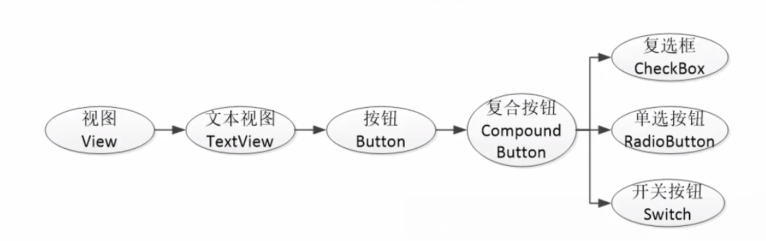

# 安卓开发
[TOC]

## 0. 前言
目前还不错的博客：
[环境搭建和日志使用](https://blog.csdn.net/yang2330648064/article/details/129008294)
[开源安卓项目教程](https://blog.csdn.net/weixin_43853746/article/details/117367078)
[适合简洁快速的查找相关组件使用](https://www.twle.cn/l/yufei/android/android-basic-gridlayout.html)
[ConstraintLayout布局的性能比较](https://mp.weixin.qq.com/s/gGR2itbY7hh9fo61SxaMQQ)
[布局案例中有简洁代码](https://blog.csdn.net/JMW1407/article/details/114622919)
[Android可视化界面布局开发技巧](https://blog.csdn.net/qq_34519487/article/details/104134467?utm_medium=distribute.pc_relevant.none-task-blog-2~default~baidujs_baidulandingword~default-0-104134467-blog-9157315.235^v43^pc_blog_bottom_relevance_base3&spm=1001.2101.3001.4242.1&utm_relevant_index=1)


## 1. andriod studio安装
安装流程：
1. 首先电脑安装JDK、开启允许虚拟化；
2. 官网下载andriod studio；
3. 点击安装选项时用costum模式选择下载相应选项；
4. 新建空项目，点击右侧的Device Manager启动安卓手机模拟器；
5. 编译运行项目，右侧会显示安卓软件。

划重点：
1. **安装参考教程 [移动应用开发环境搭建Android Studio](https://blog.csdn.net/yang2330648064/article/details/129008294)**

2. 关于报错
    - 编译运行按钮变灰 [Android studio解决关于解压项目 no moudle app打叉问题](https://blog.csdn.net/weixin_53640905/article/details/129331272?spm=1001.2101.3001.6650.1&utm_medium=distribute.pc_relevant.none-task-blog-2%7Edefault%7ECTRLIST%7ERate-1-129331272-blog-109451545.235%5Ev43%5Epc_blog_bottom_relevance_base3&depth_1-utm_source=distribute.pc_relevant.none-task-blog-2%7Edefault%7ECTRLIST%7ERate-1-129331272-blog-109451545.235%5Ev43%5Epc_blog_bottom_relevance_base3&utm_relevant_index=2)
    - no module问题解决 [Android Studio 解决 no module](https://heliquan.blog.csdn.net/article/details/100790269?spm=1001.2101.3001.6650.1&utm_medium=distribute.pc_relevant.none-task-blog-2%7Edefault%7ECTRLIST%7ERate-1-100790269-blog-129331272.235%5Ev43%5Epc_blog_bottom_relevance_base3&depth_1-utm_source=distribute.pc_relevant.none-task-blog-2%7Edefault%7ECTRLIST%7ERate-1-100790269-blog-129331272.235%5Ev43%5Epc_blog_bottom_relevance_base3&utm_relevant_index=2)

成功界面：


## 2. 项目目录结构
APP工程分为两个层次，一个是项目，一个是模块。
每个项目至少一个模块，一个模块编译一个APP，就是指运行一个模块，而不是一个项目。类似前端的一个页面。


**gradle**
一种自动编译运行打包项目的工具，类似c++里面的Cmake工具。

在Android Studio中，有不同的视图（views），以帮助开发者更好地管理和组织项目。这些视图提供了不同的角度来查看和处理项目中的文件和资源，方便开发者根据需要快速找到和编辑相关内容。下面主要介绍Project模式和android模式。

### 2.1 Android模式
“Android模式”通过按类别组织文件，使得查找和管理文件更加直观和方便，特别是对Android开发者而言。

目录图片：


目录结构：
```
MyApplication
    ├── manifests
    │   └── AndroidManifest.xml  (APP运行配置文件)
    ├── java （3个com.example.myapp包，分别是源代码和测试代码）
    │   ├── com.example.myapplication (你的应用程序包)
    │   │   ├── MainActivity.java
    │   │   └── ... (更多的Java/Kotlin文件)
    │   └── ... (测试文件等)
    └── res （当前模块的资源文件）
        ├── drawable
        │   └── ... (图像资源)
        ├── layout
        │   └── activity_main.xml (布局文件)
        ├── mipmap
        │   └── ic_launcher.png (启动图标)
        ├── values
        │   ├── strings.xml (字符串资源)
        │   ├── colors.xml (颜色资源)
        │   └── styles.xml (样式资源)
        └── ... (其他资源文件)
    └── Gradle Scripts （工程的编译配置文件）
        ├── build.gradle.kts （分别包括项目级和模块级的编译规则）
        ├── proguard-rules.pro (java代码混淆规则)
        ├── gradle.properties (配置编译工程的命令行参数，一般不动)
        ├── settings.gradle (配置需要编译哪些模块，初始为 include':app' , 表示只编译app模块)
        └── local.properties （项目本地的配置文件，描述开发者的电脑环境）
```

### 2.2 Project 模式
Project 模式有利于显示项目的完整文件系统结构，包括构建脚本、配置文件和IDE设置等。适用于需要深入了解和管理项目各个细节的开发者。

目录图片：


目录结构：
```
MyApplication
    ├── .idea (IDE相关设置)
    ├── .gradle （自动编译工具gradle产生的文件）
    ├── app （工程中的模块——Module）
    │   ├── build （工程编译目录）
    │   ├── src （源文件）
    │   │   ├── main
    │   │   │   ├── AndroidManifest.xml
    │   │   │   ├── java
    │   │   │   │   └── com.example.myapplication
    │   │   │   │       └── MainActivity.java
    │   │   │   ├── res (资源存放在这里)
    │   │   │   │   ├── drawable
    │   │   │   │   ├── layout
    │   │   │   │   └── values
    │   │   │   └── AndroidManifest.xml （APP配置文件，程序中定义的所以四大组件都需要在这个文件里注册）
    │   │   └── test （测试代码）
    │   └── build.gradle （gradle项目自动编译的配置文件）
    ├── gradle    （gradle构建目录，gradle环境支持文件夹）
    ├── build.gradle （gradle项目自动编译的配置文件，这是项目全局的gradle构建脚本）
    ├── gradle.properties (gradle运行环境配置文件)
    └── ...

```

## 3. 清单文件
在Android Studio中的清单文件（`AndroidManifest.xml`）是每个Android应用的核心配置文件。它提供了应用的基本信息和配置，定义了应用的组件、权限、硬件和软件特性等。


下面是一个典型的 `AndroidManifest.xml` 文件的示例及其各部分的作用：

```XML
<manifest xmlns:android="http://schemas.android.com/apk/res/android"
    package="com.example.myapplication"    //定义应用的包名，必须是唯一的，通常与应用在Google Play上的ID对应。
    android:versionCode="1"        // 应用的内部版本号
    android:versionName="1.0">    //根目录

    <uses-permission android:name="android.permission.INTERNET"/>        // 指定权限的名称，表示应用需要访问互联网。
    <uses-permission android:name="android.permission.ACCESS_NETWORK_STATE"/>    // 权限允许应用访问网络状态信息。

    <application
        android:allowBackup="true"        // 指定应用是否允许备份数据
        android:icon="@mipmap/ic_launcher"    //应用图标的资源ID
        android:label="@string/app_name"    //应用的标签（名称），用户可见。
        android:roundIcon="@mipmap/ic_launcher_round"    // 应用的圆形图标的资源ID。
        android:supportsRtl="true"    //指定应用是否支持从右到左的布局方向
        android:theme="@style/AppTheme">    // 应用的主题资源ID。
        
        <activity android:name=".MainActivity">        // 定义一个Activity，Activity是应用中的一个单独的用户界面组件。并指明入口界面
            <intent-filter>        // 定义Activity可以响应的Intent。
                <action android:name="android.intent.action.MAIN" />        // 指定Activity的动作。
                <category android:name="android.intent.category.LAUNCHER" />    // 指定Activity的类别
            </intent-filter>
        </activity>
        
    </application>

</manifest>
```

## 4. 界面显示和逻辑处理
类似网页开发的前端，安卓开发用XML文件描述界面，用java实现界面的逻辑跳转和运算。其中关于界面的XML在res文件的layout中，java代码在src源码中。

### 4.1 四大组件
应用组件用于显示界面和数据交互，四大组件包括：
1. Activity（活动）；
2. Service（服务）；
3. Content Provider（内容提供者）；
4. Broadcast Receiver（广播接收者）。

应用到的组件都需要在清单文件声明。

#### 4.1.1 活动（Activity）
1. 是用户操作的可视化界面；它为用户提供了一个完成操作指令的窗口。
2. 当我们创建完毕Activity之后，**需要调用setContentView()方法来完成界面的显示**；以此来为用户提供交互的入口。
 

#### 4.1.2 服务（Service）
1. 服务是Android中实现**程序后台运行**的解决方案；
2. 服务并不是运行在一个独立的进程当中的，而是依赖于创建服务时所在的应用程序进程。

例如播放音乐，下载文件。

#### 4.1.3 内容提供者（Content Provider）
1. 应用程序之间共享数据；
2. 比如你想要读取系统电话簿中的联系人，就需要通过内容提供者来实现。

#### 4.1.4 广播接收器（Broadcast Receiver）
广播接收器可以允许你的应用接收来自各处的广播消息，比如电话、短信等，当然你的应用同样也可以向外发出广播消息。


### 4.2 activity 生命周期
一个简洁的表格总结：

| 生命周期方法 | 作用 |
|--------------|------|
| `onCreate()` | 初始化Activity。设置布局、初始化数据、绑定视图等。 |
| `onStart()`  | 做一些界面即将显示时的准备工作。Activity 从不可见变为可见。 |
| `onResume()` | Activity 已经可见并且可以与用户交互。通常在此处开始动画、音乐等交互操作。 |
| `onPause()`  | Activity 进入暂停状态。保存未保存的状态或数据，停止动画和其他资源密集操作。 |
| `onStop()`   | Activity 不再可见。释放不再需要的资源，可以在这里做持久化数据存储。 |
| `onRestart()`| 在 Activity 被停止后再次启动之前调用。重新初始化资源。 |
| `onDestroy()`| Activity 即将被销毁。清理所有资源，释放内存，防止内存泄漏。 |

具体流程图：


## 5. 简单控件

### 5.1 文本显示
#### 5.1.1 文本内容显示
1. 在XML布局文件中，使用TextView控件来显示文本。
```XML
<TextView
        android:id="@+id/hello"
        android:layout_width="wrap_content"
        android:layout_height="wrap_content"
        android:text="Hello World!" />
```

2. 在java代码中通过TextView的ID引用它，并设置或更改其文本;
```java
package com.example.test;
// 省略大部分import了
import android.os.Bundle;

public class MainActivity extends AppCompatActivity {

    @Override
    protected void onCreate(Bundle savedInstanceState) {
        super.onCreate(savedInstanceState);     // 确保父类的初始化逻辑被执行。
        setContentView(R.layout.activity_main); // 设置Activity的布局文件。
        TextView tv_hello = findViewById(R.id.hello);   
        tv_hello.setText(R.string.hello);

    }
}
```

**注意：R类是什么？**
在Android开发中，`R` 是一个非常重要的类，它是由Android的构建工具自动生成的，用于管理应用的所有资源。
**`R` 类中包含了应用程序中所有资源的引用**，如布局文件、字符串、图像等。每个资源都分配了一个唯一的整数ID。

1. 定义：
    `R` 类位于 `gen`（或 `build/generated`）目录下，是一个静态类，Android Studio会在编译时根据项目中的资源文件自动生成这个类。

2. 结构

`R` 类包含若干嵌套的静态类，每个静态类对应一种资源类型。例如：

- `R.layout`：包含布局文件的资源ID。
- `R.id`：包含视图元素的资源ID。
- `R.string`：包含字符串资源的ID。
- `R.drawable`：包含图片资源的ID。
- `R.color`：包含颜色资源的ID。
- `R.raw`：包含原始资源文件的ID。

3. 生成过程
    1. **编译时生成**：每次编译项目时，Android Studio会扫描项目中的所有资源文件，并根据这些文件生成 `R` 类。
    2. **资源ID分配**：每个资源文件都会被分配一个唯一的整数ID，存储在 `R` 类的相应静态嵌套类中。
    3. **自动更新**：当你添加、修改或删除资源文件时，`R` 类会自动更新，以反映最新的资源状态。


#### 5.1.2 文本大小设置
文本大小单位相关：
通常组件用dp、文字用sp。
| 单位        | 定义                                                                                  | 用途                                                   | 示例                              |
|-------------|---------------------------------------------------------------------------------------|--------------------------------------------------------|-----------------------------------|
| `sp`        | Scale-independent Pixels，与屏幕密度无关的像素，受用户字体设置影响                    | 设置文本大小                                           | `android:textSize="16sp"`         |
| `dp`        | Density-independent Pixels，与屏幕密度无关的像素                                     | 设置视图大小和位置                                     | `android:layout_width="16dp"`     |
| `dpi`       | Dots Per Inch，每英寸的像素点数，用于描述屏幕的像素密度                              | 用于计算 `dp` 和 `sp` 与物理像素的转换                 | 常见值：160dpi（中密度），320dpi（高密度） |
| `px`        | Pixels，屏幕上的物理像素                                                              | 精确控制像素（一般不推荐用于文本大小）                 | `android:layout_width="16px"`     |
| `resolution`| 屏幕分辨率，指屏幕的像素总数，通常表示为宽度 x 高度，例如 1080 x 1920                | 描述设备屏幕的总像素数                                 | 1080 x 1920, 1440 x 2560           |

方式：
1. TextView中的testSize属性；
2. java中调用setTextSize函数，单位默认sp；

#### 5.1.3 文本颜色
1. TextView中的testColor属性；
2. java中调用setTextColor函数。

### 5.2 视图基础
#### 5.2.1 宽高
1. 布局XML文件中通过以下两个属性设置：
    - android:layout_width；
    - android:layout_height；
2. 属性值包括：
    - 具体数值dp、px；
    - 特定值：
        - wrap_content：视图的大小根据其内容确定；
        - match_parent（：视图的大小扩展以匹配其父视图的大小。

#### 5.2.2 间距
1. 布局XML文件中通过以下两个属性设置：(padding没有layout标记hhh)
    - android:layout_margin，外边距；
    - android:padding，内边距；
2. 属性值一般是数值。

```XML
<LinearLayout
    xmlns:android="http://schemas.android.com/apk/res/android"
    android:layout_width="match_parent"
    android:layout_height="match_parent"
    android:orientation="vertical"
    android:padding="16dp">

    <TextView
        android:layout_width="wrap_content"
        android:layout_height="wrap_content"
        android:text="This is a TextView"
        android:padding="10dp"
        android:layout_marginBottom="20dp" />

    <Button
        android:layout_width="wrap_content"
        android:layout_height="wrap_content"
        android:text="Click Me"
        android:layout_marginTop="20dp"
        android:padding="10dp" />

</LinearLayout>

```

#### 5.2.3 对齐方式
1. layout_gravity
    - 作用：设置视图**相对于其父布局的对齐方式**，即视图在父布局中的位置。
    - 适用范围：FrameLayout、LinearLayout、RelativeLayout 等布局容器。
    - 可选值：top、bottom、left、right、center_vertical、center_horizontal 等。

2. gravity
    - 作用：用于设置**视图内部内容的对齐方式**。
    - 适用范围：TextView、Button、ImageView 等具有内部内容的视图。
    - 可选值：top、bottom、left、right、center_vertical、center_horizontal 等。


### 5.3 布局
参考资料：[链接](https://blog.csdn.net/JMW1407/article/details/114622919)

#### 5.3.1 线性布局LinearLayout
LinearLayout沿着水平或垂直方向排列其子视图。

主要属性：
1. android:orientation ：布局方向；
    - 水平布局horizontal；
    - 垂直布局vertical
2. android:layout_weight：权重；
    - 除了被显示占据的空间以外的的空间，然后根据权重的大小来分配空间。
    - 使用权重**通常会把分配该权重方向的宽度设置为0dp**，如果未设置0dp，则该控件会占据指定的宽度，然后再加上根据权重来分配的空间。

#### 5.3.2 相对布局 RelativeLayout
用于设置某一个控件相对于其他控件的位置，这些位置可以包括上下左右等，因此相较于其他的布局方式而言具有很大的灵活性。


1. 父容器定位属性示意图

2. 根据兄弟组件定位


图中的组件1,2就是兄弟组件了,而组件3与组件1或组件2并不是兄弟组件,所以组件3不能通过 组件1或2来进行定位,比如layout_toleftof = "组件1"这样是会报错的！

#### 5.3.3 约束布局 ConstraintLayout
ConstraintLayout用于实现复杂的界面布局。**它引入了约束（Constraint）的概念**，允许开发者通过在视图之间创建约束关系来定义视图的位置和大小，从而实现灵活且可适应不同屏幕尺寸的布局，**减少布局嵌套**。还可以可视化编辑。

ConstraintLayout布局性能分析：[链接](https://mp.weixin.qq.com/s/gGR2itbY7hh9fo61SxaMQQ)

相关属性讲解：
    [链接1](https://blog.csdn.net/JMW1407/article/details/114622919)
    [链接2](https://www.twle.cn/l/yufei/android/android-basic-constraintlayout.html)


#### 5.3.4 网格布局 GridLayout
创建网格状布局的容器，它将子视图排列成行和列的网格结构。

1. GridLayout组件设置属性有：
    - android:rowCount：子视图行数；
    - android:columnCount：子视图列数；
2. 下面子视图的位置：
    - android:layout_row	设置组件位于第几行，都是从0开始。
    - android:layout_column	设置组件位于第几列
3. 设置子视图跨行和列：
    - android:layout_rowSpan	设置组件跨几行
    - android:layout_columnSpan	设置组件跨几列

参考资料：[链接](https://www.twle.cn/l/yufei/android/android-basic-gridlayout.html)


### 5.4 按钮
按钮控件中常用的事件是点击监听和长按监听。

监听器，意思是专门监听控件的动作行为，发生对应对坐，会出发监听器去执行相关逻辑。

1. 点击监听器:
    - `setOnClickListener` 函数设置，按钮被按住的时间少于500ms触发该事件。
    - 参考教程链接：[setOnclickListener讲解](https://www.cnblogs.com/hyacinthLJP/p/14313712.html)
    - 其他点击类型的监听器用法类似。
2. 按钮的禁用和恢复：
    - 禁用按钮的属性是：android:enabled="true/false"；
    - 参考教程链接：[按钮的禁用和恢复](https://blog.csdn.net/m0_52238102/article/details/125443379)

核心代码举例：
```java
package com.example.test;

import android.graphics.Color;
import android.os.Bundle;
import android.view.View;
import android.widget.Button;
import android.widget.TextView;
import android.widget.Toast;

import androidx.appcompat.app.AppCompatActivity;
import com.example.test.util.DateUtil;

public class buttonTestActivity extends AppCompatActivity {

    private TextView tv_result;
    public TextView tv_test;
    public Button btnTest;
    @Override
    protected void onCreate(Bundle savedInstanceState) {
        super.onCreate(savedInstanceState);
        setContentView(R.layout.activity_button_test);
        tv_result = findViewById(R.id.tv_result);
//      展示点击时间按钮

        Button btn_click_showTime = findViewById(R.id.bnt_show);
//        接口，setOnClickListener是view的一个内部类
        btn_click_showTime.setOnClickListener(new MyOnClickListener(tv_result));

//        打印信息的按钮
        Button btnClickPrintName = findViewById(R.id.bnt_print_name);
        btnClickPrintName.setOnClickListener(new publicButtonClick());
        Button btnClickPrintSchool = findViewById(R.id.bnt_print_school);
        btnClickPrintSchool.setOnClickListener(new publicButtonClick());

//        禁用和启用按钮
        Button btnEnable = findViewById(R.id.btn_enable);
        btnEnable.setOnClickListener(new publicButtonClick());
        Button btnDisable = findViewById(R.id.btn_disable);
        btnDisable.setOnClickListener(new publicButtonClick());

        tv_test = findViewById(R.id.tv_test);
        btnTest = findViewById(R.id.btn_test);
        btnTest.setOnClickListener(new publicButtonClick());


    }

//    内部类
    static class MyOnClickListener implements View.OnClickListener{
        private final TextView tv_result;
        public MyOnClickListener(TextView tv_result){
            this.tv_result = tv_result;
        }
        @Override
        public void onClick(View v) {
            String desc = String.format("%s 您点击了按钮 ：%s", DateUtil.getNowTime(), ((Button) v).getText());
            tv_result.setText(desc);
        }
    }

//    设置按钮点击的公共类实现
    protected class publicButtonClick implements  View.OnClickListener{

        @Override
        public void onClick(View v){
            if(v.getId() == R.id.bnt_print_name){
                Toast t = Toast.makeText(buttonTestActivity.this,"李珂你好",Toast.LENGTH_SHORT);
                t.show();
            }else if(v.getId() == R.id.bnt_print_school) {
                Toast t = Toast.makeText(buttonTestActivity.this, "武汉科技大学", Toast.LENGTH_SHORT);
                t.show();
            }else if(v.getId() == R.id.btn_enable){
//                启用按钮
                btnTest.setEnabled(true);
//                btnTest.setTextColor(Color.BLUE);
                btnTest.setTextColor(Color.BLACK);

            }else if(v.getId() == R.id.btn_disable){
//                  禁用
                btnTest.setEnabled(false);
                btnTest.setTextColor(Color.GRAY);
            }else if(v.getId() == R.id.btn_test){
//                测试
                String desc = String.format("%s 您点击了按钮 ：%s", DateUtil.getNowTime(), ((Button) v).getText());
                tv_test.setText(desc);
            }
        }
    }
}
```


### 5.5 ImageView(TODO)
图像视图展示的图片通常位于res/drawable目录中，设置显示图片有两种方式：
1. AML中，通过`android:src`设置，属性名格式形如`@drawable/图片名称`；
2. java代码中`setImageResource`设置图片资源，方法参数形如`R.drawable.图片名称`.

缩放属性：ScaleType

那么如何同时展示文本和图像呢？
1. 利用LinerLayout对ImageView和TextView组合布局；
2. 通过Button的drawable***属性设置文本周围的图表。
    - drawableTop:指定文字上方的图片；
    - drawableBottom:指定文字下方的图片；
    - drawableLeft:指定文字左方的图片；
    - drawableRight:指定文字右方的图片；

### 5.6 简易计算器案例
具体见仓库代码。


## 6. Activity详解
### 6.1 Activity的启动和结束
- 从当前页面跳转到新页面，用startActivity(new Intent(源代码.this, 目标页面.class))；
- 从当前页面回到上一个页面，相当于关闭当前页面，finish()
    ```java
    intent.setClass(MainActivity.this, CalculatorActivity.class);
    startActivity(intent);
    finish();
    ```

### 6.2 生命周期
| 生命周期方法 | 作用 |
|--------------|------|
| `onCreate()` | 初始化Activity。设置布局、初始化数据、绑定视图等。 |
| `onStart()`  | 做一些界面即将显示时的准备工作。Activity 从不可见变为可见。 |
| `onResume()` | Activity 已经可见并且可以与用户交互。通常在此处开始动画、音乐等交互操作。 |
| `onPause()`  | Activity 进入暂停状态。保存未保存的状态或数据，停止动画和其他资源密集操作。 |
| `onStop()`   | Activity 不再可见。释放不再需要的资源，可以在这里做持久化数据存储。 |
| `onRestart()`| 在 Activity 被停止后再次启动之前调用。重新初始化资源。 |
| `onDestroy()`| Activity 即将被销毁。清理所有资源，释放内存，防止内存泄漏。 |

具体流程图：


日志输出相关博客
1. [日志输出基础知识](https://blog.csdn.net/lanlangaogao/article/details/120216228)
2. [日志使用](https://www.cnblogs.com/nuoruo/p/12865385.html)

状态切换：


### 6.3 启动模式

Android中的Activity启动模式（Launch Modes）定义了在启动一个Activity时系统应如何处理现有的实例。启动模式有助于管理Activity堆栈，以确保应用程序的行为符合用户期望和应用设计。

[启动模式讲解博客推荐](https://blog.csdn.net/ElisonX/article/details/80397519)

#### 6.3.1 静态设置启动模式
1. Standard（默认模式）
    - 每次启动该Activity时，系统都会创建该Activity的一个新实例，并将其推送到任务栈的顶部。
    - 适用场景：使用于大多数普通的Activity场景、适用于每次启动时都需要新的实例的情况。
    - 示例：
        ```xml
        <activity android:name=".MyActivity"
            android:launchMode="standard" />
        ```
2. SingleTop
    - 如果当前任务栈的顶部已经是该Activity的实例，则重用该实例，否则会创建新的实例。
    - 适用场景：
        - 当频繁启动Activity，但只希望栈顶保持一个实例，如浏览器中的某些页面;
        - 使用于不需要多次创建同一个Activity实例的情况。
    - 示例：
        ```xml
        <activity android:name=".MyActivity"
            android:launchMode="singleTop" />
        ```
    - 行为：如果栈顶已经是该Activity实例，系统将调用该实例的onNewIntent()方法，而不是创建新的实例。
3. SingleTask
    - 描述：系统会在任务栈中查找是否已经存在该Activity的实例。如果找到，则重用该实例并清空其上的所有其他Activity；如果没有找到，则创建新的实例。
    - 适用场景：
        - 适用于启动时需要保证任务栈中只有一个该Activity实例的情况，如应用的主屏幕或搜索界面。
        - 适用于只希望任务栈中有一个实例并避免多次启动的情况。
    - 示例：
        ```xml
        <activity android:name=".MyActivity"
            android:launchMode="singleTask" />
        ```
    - 行为：系统调用该实例的onNewIntent()方法，并清除该实例之上的所有Activity。
4. SingleInstance
    - 描述：该Activity将独立运行在一个新的任务栈中，且在整个系统中只存在该Activity的一个实例。
    - 适用场景：
        - 适用于一些全局唯一的Activity，如闹钟、来电界面等。
        - 使用于需要完全独立任务栈的情况。
    - 示例：
        ```xml
        <activity android:name=".MyActivity"
            android:launchMode="singleInstance" />
        ```
    - 行为：系统将创建一个新的任务栈，并将该Activity作为栈中的唯一Activity。

#### 6.3.2 动态设置启动模式

动态设置启动模式并不是直接改变Activity的启动模式，而是通过Intent的标志（flags）来实现类似的效果。

总结表格：


| **Intent Flag**                     | **描述**                                                                                                                   | **示例代码**                                                                                                             |
|-------------------------------------|----------------------------------------------------------------------------------------------------------------------------|--------------------------------------------------------------------------------------------------------------------------|
| `FLAG_ACTIVITY_NEW_TASK`            | 如果要启动的Activity不存在于当前任务中，将创建一个新的任务并将该Activity放在新任务的根部。类似于 `singleTask` 启动模式。 | ```java<br>Intent intent = new Intent(context, MyActivity.class);<br>intent.setFlags(Intent.FLAG_ACTIVITY_NEW_TASK);<br>context.startActivity(intent);<br>``` |
| `FLAG_ACTIVITY_SINGLE_TOP`          | 如果要启动的Activity已经位于任务栈的顶部，则重用该Activity实例，而不是创建新的实例。类似于 `singleTop` 启动模式。        | ```java<br>Intent intent = new Intent(context, MyActivity.class);<br>intent.setFlags(Intent.FLAG_ACTIVITY_SINGLE_TOP);<br>context.startActivity(intent);<br>``` |
| `FLAG_ACTIVITY_CLEAR_TOP`           | 如果要启动的Activity在任务栈中已经存在，则将其上的所有Activity清除，并将该Activity重新创建在栈顶。类似于 `singleTask` 启动模式。 | ```java<br>Intent intent = new Intent(context, MyActivity.class);<br>intent.setFlags(Intent.FLAG_ACTIVITY_CLEAR_TOP);<br>context.startActivity(intent);<br>```  |
| `FLAG_ACTIVITY_NO_HISTORY`          | 启动的Activity在离开后不会保留在任务栈中。                                                                                  | ```java<br>Intent intent = new Intent(context, MyActivity.class);<br>intent.setFlags(Intent.FLAG_ACTIVITY_NO_HISTORY);<br>context.startActivity(intent);<br>``` |
| `FLAG_ACTIVITY_NEW_TASK | FLAG_ACTIVITY_CLEAR_TOP` | 结合两个标志，确保Activity在新任务中运行，并清除其上的所有其他Activity。类似于 `singleTask` 启动模式。                    | ```java<br>Intent intent = new Intent(context, MyActivity.class);<br>intent.setFlags(Intent.FLAG_ACTIVITY_NEW_TASK | Intent.FLAG_ACTIVITY_CLEAR_TOP);<br>context.startActivity(intent);<br>``` |

***

登录成功之后通常点击返回键，不需要再回到原来的登录界面，所以对于登录成功的activity的启动模式应该这样设置：
```java
// 登录成功之后就不需要返回到登录界面了，所以需要设置启动模式
Intent intent = new Intent(this, LoginSuccessActivity.class);
intent.setFlags(Intent.FLAG_ACTIVITY_CLEAR_TASK | Intent.FLAG_ACTIVITY_NEW_TASK);
```

### 6.4 如何修改默认样式（题外话）
有时候设置按钮的背景颜色不起作用，我们需要在清单文件中找到Theme.xml文件，然后将继承的父样式改一下：加上Bridge。

```XML
<resources xmlns:tools="http://schemas.android.com/tools">
    <!-- Base application theme. -->
<!--    <style name="Base.Theme.Test" parent="Theme.Material3.DayNight.NoActionBar">-->
    <style name="Base.Theme.Test" parent="Theme.MaterialComponents.DayNight.DarkActionBar.Bridge">
        <!-- Customize your light theme here. -->
        <!-- <item name="colorPrimary">@color/my_light_primary</item> -->
    </style>

    <style name="Theme.Test" parent="Base.Theme.Test" />
</resources>
```


### 6.5 Intent
Intent是各个组件之间信息沟通桥梁，用于各组件之间通信，主要完成以下工作：
- 标明本次通信从哪里来，到哪里去，要怎么走；
- 发起方携带本次通信需要的数据内容，接收方从收到的意图中解析数据；
- 发起方若要判断接收方的处理结果，intent就要负责让接收方传回应答的数据内容。

参考博客：
1. [Intent详细介绍](https://blog.csdn.net/wangmx1993328/article/details/83027942)
2. [Uri对象资源定位符讲解](https://blog.csdn.net/sinat_37205087/article/details/102815247)

#### 6.5.1 显式Intent和隐式Intent
1. 显示Intent   **直接指定来源活动和目标活动，属于精准匹配**。
    - Intent的构造函数中指定
        `Intent intent = new Intent(this, ActNextActivity.class)`
    - 调用setClass方法
        ```java
        Intent intent = new Intent();
        intent.setClass(this, ActNextActivity.class);
        ```
    - 调用setComponent方法
        ```java
        Intent intent = new Intent();
        //创建包含目标活动在内的组件名称
        ComponentName conponent = new ComponentName(this, ActNextActivity.class);
        intent.setComponent(component);
        ```

2. 隐式Intent 没有明确指出要跳转的目标，只给出一个动作字符串让系统自动匹配，属于模糊匹配。
    - 通常APP不希望向外部暴露活动名称，只给出一个实现自定义好的标记穿，这样大家约定俗成按图索骥。隐式意图便起到标记过滤的作用。
    - Intent 类定义了一系列动作常量对应不同的意图：
    以下是常见的 `Activity` `Intent` `Action` 常量及其对应的常量值和描述的表格：
    | 常量名称               | 常量值                         | 意义/描述                          |
    |--------------------|------------------------------|-----------------------------------|
    | ACTION_MAIN        | android.intent.action.MAIN   | 应用程序入口                         |
    | ACTION_VIEW        | android.intent.action.VIEW   | 显示数据给用户                        |
    | ACTION_ATTACH_DATA | android.intent.action.ATTACH_DATA | 指明附加信息给其他地方的一些数据                |
    | ACTION_EDIT        | android.intent.action.EDIT   | 显示可编辑的数据                        |
    | ACTION_PICK        | android.intent.action.PICK   | 选择数据                            |
    | ACTION_CHOOSER     | android.intent.action.CHOOSER | 显示一个Activity选择器                 |
    | ACTION_GET_CONTENT | android.intent.action.GET_CONTENT | 获得内容                            |
    | ACTION_DIAL        | android.intent.action.DIAL   | 显示打电话面板                        |
    | ACTION_CALL        | android.intent.action.CALL   | 直接打电话                           |
    | ACTION_SEND        | android.intent.action.SEND   | 直接发短信                           |
    | ACTION_SENDTO      | android.intent.action.SENDTO | 选择发短信                           |
    | ACTION_ANSWER      | android.intent.action.ANSWER | 应答电话                            |
    | ACTION_INSERT      | android.intent.action.INSERT | 插入数据                            |
    | ACTION_DELETE      | android.intent.action.DELETE | 删除数据                            |
    | ACTION_RUN         | android.intent.action.RUN    | 运行数据                            |
    | ACTION_SYNC        | android.intent.action.SYNC   | 同步数据                            |


3. Uri和category
    Intent动作既可以用setAction方法指定，也可以用构造函数Intet(String action)直接生成意图对象。由于动作是模糊匹配的，需要更加详细的路径，比如仅仅知道某人住在天通苑小区，并不能直接找到他家，还得说明具体地址。**Uri和Category便是这样的路径和门类信息。Uri数据可以用构造函数Intent(String action,Uri uri)在生成对象时指定，也可以通过setData方法指定；Category可以通过addCategory方法指定。**

    `Uri` 是 Android 中表示统一资源标识符（Uniform Resource Identifier）的类，用于表示和处理资源的引用。`Uri` 类在 Android 开发中非常常见，通常用于在应用之间传递数据、访问内容提供者（Content Providers）、处理网络资源等。
    - Uri 的重要方法
        - `parse(String uriString)`: 将字符串解析为一个 `Uri` 对象。
        - `getScheme()`: 返回 URI 的方案（例如 `http`, `tel`, `mailto`）。
        - `getHost()`: 返回 URI 的主机部分。
        - `getPath()`: 返回 URI 的路径部分。
        - `getQueryParameter(String key)`: 返回 URI 中查询参数的值。

    

#### 6.5.2 Intent总结
Intent 是 Android 系统中的一个重要概念，用于在不同组件之间进行通信和交互。它表示了应用程序中执行某个动作的意图或者计划。其中有以下常见属性

1. 动作（Action）

```java
// 创建一个 Intent 对象，并指定动作为 ACTION_VIEW，用于查看指定的数据
Intent viewIntent = new Intent(Intent.ACTION_VIEW);
viewIntent.setData(Uri.parse("https://www.example.com"));
startActivity(viewIntent);
```

在这个例子中，我们创建了一个 Intent 对象，并指定了动作为 `ACTION_VIEW`，表示要查看数据。然后，我们通过 `setData()` 方法设置了要查看的数据的 URI，并调用 `startActivity()` 方法启动相应的 Activity。

2. 数据（Data）

```java
// 创建一个 Intent 对象，并指定数据为一个电话号码，动作为 ACTION_DIAL，用于拨打电话
Intent dialIntent = new Intent(Intent.ACTION_DIAL);
dialIntent.setData(Uri.parse("tel:1234567890"));
startActivity(dialIntent);
```

在这个例子中，我们创建了一个 Intent 对象，并指定了数据为一个电话号码的 URI，然后指定了动作为 `ACTION_DIAL`，表示要拨打电话。最后，我们调用 `startActivity()` 方法启动相应的 Activity。

3. 类别（Category）

```java
// 创建一个 Intent 对象，并添加类别为 DEFAULT，表示默认的操作
Intent defaultIntent = new Intent();
defaultIntent.setAction(Intent.ACTION_VIEW);
defaultIntent.addCategory(Intent.CATEGORY_DEFAULT);
defaultIntent.setData(Uri.parse("https://www.example.com"));
startActivity(defaultIntent);
```

在这个例子中，我们创建了一个 Intent 对象，并添加了类别为 `CATEGORY_DEFAULT`，表示默认的操作。然后，我们指定了动作为 `ACTION_VIEW`，并设置了要查看的数据的 URI，最后启动相应的 Activity。

4. 附加数据（Extra）

```java
// 创建一个 Intent 对象，并添加附加数据，传递用户名到下一个 Activity
Intent intent = new Intent(this, NextActivity.class);
intent.putExtra("USERNAME", "John");
startActivity(intent);
```

在这个例子中，我们创建了一个 Intent 对象，并使用 `putExtra()` 方法添加了附加数据，将用户名传递到下一个 Activity。在下一个 Activity 中，我们可以使用 `getIntent().getStringExtra("USERNAME")` 方法获取这个附加数据。

5. 标记（Flag）

```java
// 创建一个 Intent 对象，并添加标记 FLAG_ACTIVITY_NEW_TASK，表示启动一个新的任务
Intent intent = new Intent(this, MainActivity.class);
intent.setFlags(Intent.FLAG_ACTIVITY_NEW_TASK);
startActivity(intent);
```

在这个例子中，我们创建了一个 Intent 对象，并使用 `setFlags()` 方法添加了标记 `FLAG_ACTIVITY_NEW_TASK`，表示启动一个新的任务。这个标记告诉系统要创建一个新的任务栈来启动 Activity。


### 6.6 Activity传送数据

Intent用Bundle对象存放待传递的数据信息。
Bundle对象操作各类数据的读写方法如图：


1. 向下一个Activity传送数据
    - 用Bundle对象存放信息数据；
    - 发送方设置Intent的putExtras方法，将额外数据发送；
    - 接收方调用Intent对象的getExtras方法取出消息包裹。
    - 发送方代码：
        ```java
        Intent intent = new Intent(this, ActReceiveActivity.class);
        Bundle bundle = new Bundle();
        // 创建一个新包裹
        bundle.putString("request_time", DateUtil.getNowTime());
        bundle.putString("request_content", tv_send.getText().toString());
        intent.putExtras(bundle);
        startActivity(intent);
        ```
    - 接收方代码：
        ```java
        tv_receive = findViewById(R.id.tv_receive);
        //从上一个页面传来的意图中获取快递包裹
        Bundle bundle = getIntent().getExtras();
        String request_time = bundle.getString("request_time");
        String request_content = bundle.getString("request_content");
        String desc = String.format("收到请求消息：\n请求时间为%s\n 请求内容为：%s",request_time,request_content);
        tv_receive.setText(desc);
        ```

2. 向上一个Activity传送数据
    处理下一个页面的应答数据，详细步骤如下：
    1. 上一个页面打包好请求数据，registerForActivityResult()方法来注册一个用于处理活动结果的回调函数执行跳转动作；
    2. 下一个页面接受并解析请求数据，进行相应处理；
    3. 下一个页面在返回上一个页面时，打包应答数据并调用**setResult**方法返回数据包裹；
    4. 上一个页面registerForActivityResult()方法的回调函数处理接收到的数据。

    示例代码如下:
    上一个页面的代码：
    ```java
    // 重写一下接受数据的
    register = registerForActivityResult(new ActivityResultContracts.StartActivityForResult(), result -> {
        if(result != null){
            Intent intent = result.getData();
            if(intent != null && result.getResultCode() == ActSenActivity.RESULT_OK){
                Bundle bundle = intent.getExtras();
                String request_time = bundle.getString("response_time");
                String request_content = bundle.getString("response_content");
                String desc = String.format("收到返回消息：\n应答时间为%s\n应答内容为%s",request_time,request_content);
                //显示返回详情的文字
                tv_response.setText(desc);
            }
        }
    });

    // 点击事件跳转
    public void onClick(View v) {
        Intent intent = new Intent(this, ActReceiveActivity.class);
        Bundle bundle = new Bundle();
        // 创建一个新包裹
        bundle.putString("request_time", DateUtil.getNowTime());
        bundle.putString("request_content", mRequest);
        intent.putExtras(bundle);

        // 转到下一个页面之后，也要右一个接口来更新下一个activity传过来的数据
        // startActivityForResult(); 该方法已经被弃用
        // 用全局变量register的launch方法跳转
        register.launch(intent);
        // 就不需要用这个跳转了
        //startActivity(intent);

    }

    ```

    下一个页面的代码：
    ```java
    Intent intent = new Intent();
    Bundle bundle = new Bundle();
    bundle.putString("response_time", DateUtil.getNowTime());
    bundle.putString("response_content", res);
    // 注意要将bundle放到新建的intent中
    intent.putExtras(bundle);
    setResult(Activity.RESULT_OK, intent);
    finish();
    ```

#### 6.6.1 着重分析registerForActivityResult()方法

对于以上代码：
在主活动（MainActivity）中，创建一个 ActivityResultLauncher 实例，使用 registerForActivityResult() 方法。
这个方法需要两个参数：
1. 一个 ActivityResultContract 对象，指定启动活动的类型，这里使用 new ActivityResultContracts.StartActivityForResult()。
2. 一个 ActivityResultCallback 回调对象，定义如何处理返回的结果。

在主活动中，使用 launcher.launch(intent) 启动第二个活动（SecondActivity）。

处理返回结果：
在 ActivityResultCallback 的 onActivityResult() 方法中处理返回的结果。
在 Android 中，**ActivityResultCallback 是一个接口，用于处理活动返回的结果。你需要实现 onActivityResult() 方法，系统会在活动完成并返回结果时调用这个方法。**


Lambda表达式：
JDK1.8之后引入的一种语法，他的写法是使用一个->符号，箭头将Lambda表达式分为左右两部分，左边写的是实现的这个接口中的抽象方法中的形参列表，右边就是对抽象方法的处理；
`实现的这个接口中的抽象方法中的形参列表 -> 抽象方法的处理`

例如：
```java
// 定义一个带一个参数的接口
interface MyFunction {
    void apply(String s);
}

// 使用Lambda表达式
MyFunction printFunction = (String s) -> System.out.println(s);
printFunction.apply("Hello, Lambda with parameter!"); // 输出：Hello, Lambda with parameter!

```


### 6.7 为活动补充附加信息
#### 6.7.1 利用资源文件配置字符串
资源文件配置字符串使得文本内容可以集中管理，方便统一修改和国际化处理。方法如下：

1. 在res/values/strings.xml 添加string标签： 
   ```xml
   <!-- strings.xml -->
   <resources>
       <string name="app_name">MyApp</string>
       <string name="welcome_message">Welcome to our app!</string>
       <string name="button_text">Click Me</string>
   </resources>
   ```

3. **使用字符串资源：** 在布局文件、Java 代码或其他资源文件中，可以通过 `@string/资源名称` 的方式来引用字符串资源。

   - 在布局文件中：
     ```xml
     <!-- activity_main.xml -->
     <TextView
         android:id="@+id/textView"
         android:layout_width="wrap_content"
         android:layout_height="wrap_content"
         android:text="@string/welcome_message" />
     ```
   
   - 在 Java 代码中：
    getString方法是在context类中，activity直接继承该类，所以可以直接使用该方法。
     ```java
     // MainActivity.java
     String message = getString(R.string.welcome_message);
     ```


#### 6.7.2 利用元数据传递配置信息
参考博客：
    [元数据传递配置信息](https://blog.csdn.net/Tir_zhang/article/details/126956205#:~:text=%E5%85%83%E6%95%B0%E6%8D%AE%E4%B8%8D%E4%BB%85%E8%83%BD%E4%BC%A0%E9%80%92%E7%AE%80%E5%8D%95%E7%9A%84%E5%AD%97%E7%AC%A6%E4%B8%B2%E5%8F%82%E6%95%B0%EF%BC%8C%E8%BF%98%E8%83%BD%E4%BC%A0%E9%80%81%E6%9B%B4%E5%A4%8D%E6%9D%82%E7%9A%84%E8%B5%84%E6%BA%90%E6%95%B0%E6%8D%AE%EF%BC%8C%E5%A6%82%E6%94%AF%E4%BB%98%E5%AE%9D%E7%9A%84%E5%BF%AB%E6%8D%B7%E5%BC%8F%E8%8F%9C%E5%8D%95%E3%80%82,%E5%88%A9%E7%94%A8%E5%85%83%E6%95%B0%E6%8D%AE%E9%85%8D%E7%BD%AE%E5%BF%AB%E6%8D%B7%E8%8F%9C%E5%8D%95%20%E5%85%83%E6%95%B0%E6%8D%AE%E7%9A%84meta-data%E6%A0%87%E7%AD%BE%E9%99%A4%E4%BA%86%E5%89%8D%E9%9D%A2%E7%9A%84name%E5%B1%9E%E6%80%A7%E5%92%8Cvalue%E5%B1%9E%E6%80%A7%EF%BC%8C%E8%BF%98%E6%8B%A5%E6%9C%89resource%E5%B1%9E%E6%80%A7%EF%BC%8C%E8%AF%A5%E5%B1%9E%E6%80%A7%E5%8F%AF%E6%8C%87%E5%AE%9A%E4%B8%80%E4%B8%AAXML%E6%96%87%E4%BB%B6%EF%BC%8C%E8%A1%A8%E7%A4%BA%E5%85%83%E6%95%B0%E6%8D%AE%E6%83%B3%E8%A6%81%E7%9A%84%E5%A4%8D%E6%9D%82%E4%BF%A1%E6%81%AF%E4%BF%9D%E5%AD%98%E4%BA%8EXML%E6%95%B0%E6%8D%AE%E4%B9%8B%E4%B8%AD%E3%80%82)

1. 格式
    <meta-data android:name="weather" android:value="xxx"/>

2. 什么场景需要使用？
    使用第三方SDK，需要在APP应用内使用别的APP的整合包，如使用微信登录、某某地图等。

3. 在java代码中，获取元数据信息的步骤分为下列三步：
    - 调用getPackageManager方法获得当前应用的包管理器；
    - 调用包管理器的getActivityInfo方法获得当前活动的信息对象；
    - 活动信息对象的metaData是Bundle包裹类型，调用包裹对象的getString即可获得指定名称的参数值。

元数据不仅能传递简单的字符串参数，还能传送更复杂的资源数据，如支付宝的快捷式菜单。

利用元数据配置快捷菜单
元数据的meta-data标签除了前面的name属性和value属性，还拥有resource属性，该属性可指定一个XML文件，表示元数据想要的复杂信息保存于XML数据之中。

利用元数据配置快捷菜单的步骤如下：
1. 在res/values/strings.xml添加各个菜单项名称的字符串配置
2. 创建res/xml/shortcuts.xml，在该文件中填入各组菜单项的快捷方式定义。
3. 给activity节点注册元数据的快捷菜单配置。
 例：长按应用出现快捷菜单

清单文件AndroidManifest.xml
```XML
<activity
    android:name=".ActStartActivity"
    android:exported="true">
    <intent-filter>
        <action android:name="android.intent.action.MAIN" />

        <category android:name="android.intent.category.LAUNCHER" />
    </intent-filter>
    <meta-data android:name="android.app.shortcuts" android:resource="@xml/shortcuts"/>
</activity>
```新建shortcuts.xml文件用于配置快捷菜单
```XML
<resources xmlns:android="http://schemas.android.com/apk/res/android">
    <shortcut
        android:shortcutId="first"
        android:enabled="true"
        android:icon="@mipmap/ic_launcher"
        android:shortcutLongLabel="@string/first_long"
        android:shortcutShortLabel="@string/first_short">
<!--文字太长则显示shotLabel ↑-->
<!--点击选项跳转到的页面 ↓-->
        <intent
            android:action="android.intent.action.VIEW"
            android:targetPackage="com.example.chapter2"
            android:targetClass="com.example.chapter2.ActStartActivity"/>
        <categories android:name="android.shortcut.conversation"/>
    </shortcut>
</resources>
```

运行结果：长按出现快捷菜单


## 7. java复习

### 7.1 面向对象几个重要思想（封装、继承、多态、接口）
当然，我可以帮助你总结 Java 中的封装、继承、多态和接口，并提供简单的代码示例。

1. 封装 (Encapsulation)
**封装**是将对象的状态（属性）私有化，并通过公共的方法（getter 和 setter）提供访问。

**示例**：
```java
public class Person {
    // 私有属性
    private String name;
    private int age;

    // 构造函数
    public Person(String name, int age) {
        this.name = name;
        this.age = age;
    }

    // getter 方法
    public String getName() {
        return name;
    }

    // setter 方法
    public void setName(String name) {
        this.name = name;
    }

    public int getAge() {
        return age;
    }

    public void setAge(int age) {
        this.age = age;
    }

    // 显示信息的方法
    public void displayInfo() {
        System.out.println("Name: " + name + ", Age: " + age);
    }
}
```

**说明**：
- 属性 `name` 和 `age` 被私有化，不能直接访问。
- 提供公共的 `getter` 和 `setter` 方法来访问和修改属性。

2. 继承 (Inheritance)

**继承**是指一个类（子类）继承另一个类（父类）的属性和方法，使子类能够重用父类的代码。

**示例**：
```java
// 父类
public class Animal {
    public void eat() {
        System.out.println("This animal eats food.");
    }
}

// 子类继承父类
public class Dog extends Animal {
    // 子类特有的方法
    public void bark() {
        System.out.println("The dog barks.");
    }
}

// 测试继承
public class Main {
    public static void main(String[] args) {
        Dog dog = new Dog();
        dog.eat();  // 调用父类的方法
        dog.bark(); // 调用子类的方法
    }
}
```

**说明**：
- 子类 `Dog` 继承父类 `Animal`，可以直接使用父类的 `eat()` 方法。
- 子类 `Dog` 有自己的 `bark()` 方法。

3. 多态 (Polymorphism)

**多态**允许使用父类引用指向子类对象，从而调用子类的重写方法。

**示例**：
```java
// 父类
public class Animal {
    public void makeSound() {
        System.out.println("Some sound...");
    }
}

// 子类重写父类的方法
public class Dog extends Animal {
    @Override
    public void makeSound() {
        System.out.println("Bark");
    }
}

public class Cat extends Animal {
    @Override
    public void makeSound() {
        System.out.println("Meow");
    }
}

// 测试多态
public class Main {
    public static void main(String[] args) {
        Animal myDog = new Dog();
        Animal myCat = new Cat();

        myDog.makeSound(); // 输出 "Bark"
        myCat.makeSound(); // 输出 "Meow"
    }
}
```

**说明**：
- 使用父类 `Animal` 的引用指向子类对象 `Dog` 和 `Cat`。
- 调用 `makeSound()` 方法时，根据实际对象类型（`Dog` 或 `Cat`）调用相应的重写方法。

4. 接口 (Interface)

**接口**定义了一组抽象方法，任何类实现接口时，必须提供这些方法的实现。

**示例**：
```java
// 定义接口
interface Animal {
    void eat();
    void makeSound();
}

// 实现接口
public class Dog implements Animal {
    @Override
    public void eat() {
        System.out.println("Dog eats bones.");
    }

    @Override
    public void makeSound() {
        System.out.println("Dog barks.");
    }
}

public class Cat implements Animal {
    @Override
    public void eat() {
        System.out.println("Cat eats fish.");
    }

    @Override
    public void makeSound() {
        System.out.println("Cat meows.");
    }
}

// 测试接口
public class Main {
    public static void main(String[] args) {
        Animal dog = new Dog();
        Animal cat = new Cat();

        dog.eat();       // 输出 "Dog eats bones."
        dog.makeSound(); // 输出 "Dog barks."

        cat.eat();       // 输出 "Cat eats fish."
        cat.makeSound(); // 输出 "Cat meows."
    }
}
```

**说明**：
- 接口 `Animal` 定义了两个抽象方法 `eat()` 和 `makeSound()`。
- 类 `Dog` 和 `Cat` 实现了 `Animal` 接口，并提供了这两个方法的具体实现。
- 使用接口类型的引用来调用具体实现的方法。

总结
- **封装**：通过私有属性和公共方法控制对对象数据的访问。
- **继承**：通过继承父类的属性和方法，实现代码重用。
- **多态**：通过父类引用指向子类对象，实现方法的动态调用。
- **接口**：定义一组抽象方法，类通过实现接口提供具体实现。


### 7.2 常用数据类型
1. 基本数据类型

| 数据类型  | 位数 | 默认值  | 最小值                     | 最大值                      | 示例       |
|-----------|------|---------|----------------------------|-----------------------------|------------|
| `byte`    | 8    | 0       | -128                       | 127                         | `byte b = 10;` |
| `short`   | 16   | 0       | -32,768                    | 32,767                      | `short s = 100;` |
| `int`     | 32   | 0       | -2^31                      | 2^31-1                      | `int i = 1000;` |
| `long`    | 64   | 0L      | -2^63                      | 2^63-1                      | `long l = 10000L;` |
| `float`   | 32   | 0.0f    | 1.4E-45 (最小正数)         | 3.4028235E38 (最大正数)     | `float f = 10.5f;` |
| `double`  | 64   | 0.0d    | 4.9E-324 (最小正数)        | 1.7976931348623157E308 (最大正数) | `double d = 20.5;` |
| `char`    | 16   | '\u0000'| '\u0000' (最小值)          | '\uffff' (最大值)           | `char c = 'A';` |
| `boolean` | 1    | false   | false                      | true                        | `boolean b = true;` |

2. Number和Math类

参考博客：[菜鸟教程](https://www.runoob.com/java/java-number.html)

3. String类
    参考博客：
    - [菜鸟教程String类](https://www.runoob.com/java/java-string.html)
    - [StringBuffer 和 StringBuilder 类](https://www.runoob.com/java/java-stringbuffer.html)

4. 数组
    和Number类与Math相似，一个是数据，一个是相当于工具类。
    参考博客：
    - [数组](https://www.runoob.com/java/java-array.html)
    - 表格总结：

        | 方法                | 描述                                           | 示例                                                                   |
        |---------------------|------------------------------------------------|------------------------------------------------------------------------|
        | `sort(array)`       | 对数组进行排序                                 | `Arrays.sort(numbers);`                                                |
        | `binarySearch(array, key)` | 使用二分搜索算法在数组中查找元素          | `Arrays.binarySearch(numbers, 5);`                                     |
        | `copyOf(array, length)`    | 复制数组                                  | `Arrays.copyOf(original, 5);`                                          |
        | `equals(array1, array2)`   | 比较两个数组是否相等                      | `Arrays.equals(array1, array2);`                                       |
        | `fill(array, value)`       | 用指定值填充数组                          | `Arrays.fill(numbers, 7);`                                             |
        | `toString(array)`          | 将数组转换为字符串表示形式                | `Arrays.toString(numbers);`                                            |
        | `asList(array)`            | 将数组转换为 `List`                       | `Arrays.asList(array);`                                                |

5. 日期
    1. Date 类来封装当前的日期和时间；
    2. SimpleDateFormat 是一个以语言环境敏感的方式来格式化和分析日期的类。SimpleDateFormat 允许你选择任何用户自定义日期时间格式来运行。
    参考博客: [日期API](https://www.runoob.com/java/java-date-time.html)

6. 正则表达式
    参考教程：
    - [详细讲解](https://www.runoob.com/java/java-regular-expressions.html)
    - [常用表达式全集](https://www.jyshare.com/front-end/854/)

    简单总结：
    1. `^` 和 `$`
        - `^`: 匹配字符串的开始。例如，`^abc` 匹配以 "abc" 开头的字符串。
        - `$`: 匹配字符串的结束。例如，`abc$` 匹配以 "abc" 结尾的字符串。

    2. 字符簇 `[]`
        - `[]`: 表示字符簇，匹配方括号内的任意一个字符。例如，`[abc]` 匹配 "a"、"b" 或 "c" 中的任意一个。
        - `[^]`: 否定字符簇，匹配不在方括号内的任意一个字符。例如，`[^abc]` 匹配除 "a"、"b"、"c" 以外的任意一个字符。
        - `[-]`: 匹配范围内的字符。例如，`[a-z]` 匹配任何小写字母，`[0-9]` 匹配任何数字。

    3. 特殊字符 `.`
        1c"、"a-c" 等。

    4. 数量修饰符 `{}`、`*`、`+`、`?`
        - `{x}`: 匹配前面的元素恰好出现 `x` 次。例如，`a{3}` 匹配 "aaa"。
        - `{x,y}`: 匹配前面的元素至少出现 `x` 次，至多出现 `y` 次。例如，`a{2,4}` 匹配 "aa"、"aaa" 或 "aaaa"。
        - `{x,}`: 匹配前面的元素至少出现 `x` 次。例如，`a{2,}` 匹配 "aa"、"aaa"、"aaaa" 等。
        - `*`: 匹配前面的元素零次或多次（相当于 `{0,}`）。例如，`a*` 匹配 ""（空字符串）、"a"、"aa"、"aaa" 等。
        - `+`: 匹配前面的元素一次或多次（相当于 `{1,}`）。例如，`a+` 匹配 "a"、"aa"、"aaa" 等。
        - `?`: 匹配前面的元素零次或一次（相当于 `{0,1}`）。例如，`a?` 匹配 ""（空字符串）或 "a"。

    5. 具体的例子：
        - `^a.*b$`: 匹配以 "a" 开头，以 "b" 结尾的字符串，中间可以有任意字符。例如，"a123b"、"ab"。
        - `[a-zA-Z]`: 匹配任意一个字母，不区分大小写。
        - `\d{2,4}`: 匹配一个至少包含2个，至多包含4个数字的字符串。例如，"12"、"123"、"1234"。
        - `a*`: 匹配零个或多个 "a"。例如，""（空字符串）、"a"、"aaa"。
        - `a+`: 匹配一个或多个 "a"。例如，"a"、"aa"、"aaa"。
        - `a?`: 匹配零个或一个 "a"。例如，""（空字符串）或 "a"。


### 7.3 static

参考博客：
    [static用法](https://blog.csdn.net/double222222/article/details/136318553)


| 用法      | 示例                                |
|-----------|------------------------------------|
| 静态变量  | `static int count = 0;`            |
| 静态方法  | `public static void myMethod() {}` |
| 静态代码块| `static { // 初始化代码 }`         |
| 静态内部类| `static class StaticInnerClass {}` |

优点：
1. **共享数据：** 静态成员可以在多个对象之间共享数据，节省内存空间。
2. **方便访问：** 可以直接通过类名访问静态成员，无需创建类的实例，提高了代码的灵活性和可读性。
3. **节省内存：** 静态成员只会在内存中分配一次，所有对象共享同一份副本，减少了内存开销。
4. **简化代码：** 静态成员的使用简化了代码结构，提高了代码的清晰度和可维护性。


## 8. 中级控件
### 8.1 图形绘制

参考博客：
1. [图形绘制shape类型](https://blog.csdn.net/notthin/article/details/121899183)
2. [九宫格图片](https://blog.csdn.net/csdnzouqi/article/details/118891063)
3. [状态列表图形](https://blog.csdn.net/abcdefg1289/article/details/138835737)


#### 8.1.1 Shape
Shape是一种在 XML 文件中定义的通用形状。
文件位置：res / drawable / filename.xml
文件名用作资源 ID。

在 Java 中：R.drawable.filename
在 XML 中：@[package:]drawable/filename

使用：
1. shape.xml形状
```XML
<?xml version="1.0" encoding="utf-8"?>
<shape xmlns:android="http://schemas.android.com/apk/res/android">
<!--   指定内部填充颜色     -->
    <solid android:color="#ffdd66"/>
<!--    指定形状轮廓的粗细和颜色-->
    <stroke
        android:width="1dp"
        android:color="#aaaaaa"/>
<!--    指定形状四个圆角的半径-->
    <corners
        android:radius="10dp"/>
</shape>
```

2. 使用的java代码
```java
v_content.setBackgroundResource(R.drawable.shape_rect_gold);
```

#### 8.1.2 状态列表图形
常见的图形文件一般为静态图形，但有时会用到动态图形，比如按钮控件的背景在正常情况下是凸起的，在按下时是凹陷的，从按下到弹起的过程，用户便晓得点击了该按钮。根据不同的触摸情况变更图形状态，这种情况用到了Drawable 的一个子类 StateListDrawable （状态列表图形），它在 XML 文件中规定了不同状态时候所呈现的图形列表。

<?xml version="1.0" encoding="utf-8"?>
<selector xmlns:android="http://schemas.android.com/apk/res/android">
 
    <item android:drawable="@drawable/button_pressed" android:state_pressed="true" />
    <item android:drawable="@drawable/button_normal" />
 
</selector>
上述xml文件的关键点是state_pressed属性，该属性表示按下状态，值为true表示按下时显示button_pressed图像，其余情况显示button_normal图像。


### 8.2 选择按钮

CompoundButton类时符合按钮，由他派生而来的子类包括：复选框CheckBox、单选按钮RadioButton以及开关按钮Switch。


#### 8.2.1 复选框CheckBox
ndroid CheckBox (复选框) 继承自 Button ，可以说是只有两种状态的按钮 (选中或未选中状态)

可以把多个 CheckBox 放在一起实现同时选中多项，但是，记住，它们之间没有任何关系，一个的选中并不会影响另一个选中或者不选中。

CheckBox在XML属性有：
1. checked：指定按钮的勾选状态，true表示勾选，false表示没有勾选；
2. button：指定左侧勾选图标的图形资源。

在java代码中主要有四种方法：
1. setChecked：设置按钮的勾选状态；
2. setButtonDrawable：设置左侧勾选图形的图标；
3. setOnCheckedChangeListener：设置勾选状态变化的监听器；
4. isChecked：判断按钮是否勾选。

举例：
```XML
<CheckBox
    android:id="@+id/ck_system"
    android:layout_width="match_parent"
    android:layout_height="wrap_content"
    android:minHeight="48dp"
    android:padding="5dp"
    android:text="这是系统的checkbox"
    android:textSize="30sp" />

<CheckBox
    android:id="@+id/ck_custom"
    android:layout_width="match_parent"
    android:layout_height="wrap_content"
    android:minHeight="48dp"
    android:padding="5dp"
    android:text="这个checkBox换了图标"
    android:button="@drawable/checkbox_selector"
    android:layout_marginTop="10dp"
    android:textSize="30sp" />
```

java代码
```java
// 设置checkbox的监听
CheckBox ck_system = findViewById(R.id.ck_system);
CheckBox ck_custom = findViewById(R.id.ck_custom);

ck_system.setOnCheckedChangeListener(this);
ck_custom.setOnCheckedChangeListener(this);

@Override
public void onCheckedChanged(CompoundButton buttonView, boolean isChecked) {
    String desc = String.format("您%s了这个checkbox", isChecked ? "勾选" : "取消勾选");
    buttonView.setText(desc);
}

```

#### 8.2.2 开关按钮Switch

参考博客：
1. [开关按钮教程](https://blog.csdn.net/qq_34215018/article/details/127690304)

Switch开关按钮属性介绍
- textOn：开关按钮打开时显示的文字。
- textOff：开关按钮关闭时显示的文字。
- thumb：开关按钮上原型滑块的样式，自定义样式时需要设置此样式。
- track：开关按钮下面导轨的样式，自定义样式时需要设置此样式。
- switchTextAppearance：设置文本的风格，可以用来设置开关两种状态下的文本样式。
- checked：设置初始选中状态
- showText：设置是否显示开关上的文字（android系统中默认不显示）


#### 8.2.3 单选按钮RadioButton

单选按钮要在一组按钮中选择其中一项，并且不能多选，这要求有一个容器确定这一组按钮的范围，这个容器就是单选组RadioGroup.

RadioGroup本质是一个布局（呈现水平排布），同一组的RadioButton都要放在同一个RadioGroup节点下面，也可以放置其他组件。

xml代码：
```xml
<RadioGroup
    android:id="@+id/rg_gender"
    android:layout_width="match_parent"
    android:layout_height="wrap_content"
    android:orientation="horizontal">
    <RadioButton
        android:id="@+id/rb_male"
        android:layout_width="0dp"
        android:layout_height="wrap_content"
        android:layout_weight="1"
        android:text="男"/>
    <RadioButton
        android:id="@+id/rb_female"
        android:layout_width="0dp"
        android:layout_height="wrap_content"
        android:layout_weight="1"
        android:text="女"/>
</RadioGroup>
```

java代码：
```java
RadioGroup rb_gender = findViewById(R.id.rg_gender);
rb_tvresult = findViewById(R.id.rb_tvresult);
rb_gender.setOnCheckedChangeListener(this);

@Override
public void onCheckedChanged(RadioGroup group, int checkedId) {
    if (checkedId == R.id.rb_male){
        rb_tvresult.setText("你是一个帅气的男孩");
    }else if( checkedId == R.id.rb_female){
        rb_tvresult.setText("你是一个可爱的女孩");
    }
}
```

### 8.3 文本输入-编辑框EditText

EditText(输入框)，是安卓开发布局时比较常用的控件，和TextView非常类似，最大的区别是：EditText可以接受用户输入。

1. `EditText`控件xml中常见属性：

    | 属性 | 说明 |
    |------|------|
    | `android:inputType=""` | 输入内容的类型（`number` - 数字；`numberDecimal` - 浮点数） |
    | `android:capitalize=""` | 英文大写设置（`characters` - 每个英文字母都大写；`sentences` - 仅第一个字母大写；`words` - 每一个单词首字母大写，用空格区分单词） |
    | `android:minLines=""` | 最小行数 |
    | `android:maxLines=""` | 最大行数 |
    | `android:singleLine=""` | 单行，不换行（为`true`时，单行显示） |
    | `android:maxLength=""` | 输入字数限制 |
    | `android:password=""` | 文字为密码形式，样式： · · · · · · |
    | `android:phoneNumber=""` | 输入电话号码（为`true`时，起效） |

2. java中主要函数使用：

    | 函数 | 说明 |
    |------|------|
    | `getText()` | 获取输入框的文本内容，返回 `Editable` 对象。 |
    | `setText(CharSequence text)` | 设置输入框的文本内容。 |
    | `getText().toString()` | 获取输入框的文本内容，返回 `String` 对象。 |
    | `setOnFocusChangeListener` | 监听组件。 |
    | `getInputType()` | 获取当前的输入类型。 |
    | `requestFocus()` | 请求获取焦点。 |

3. 代码举例：监听号码，判断密码格式：
    ```java
    // 声明周期函数
    et_phone = findViewById(R.id.et_phone);
    et_pwd = findViewById(R.id.et_password);
    et_pwd.setOnFocusChangeListener(this);
    findViewById(R.id.btn_login).setOnClickListener(this);

    // 监听事件
    public void onFocusChange(View v, boolean hasFocus) {
        if (hasFocus) {
            String phone = et_phone.getText().toString();
            // 手机号码不足11位
            if ( TextUtils.isEmpty(phone) || phone.length() < 11) {
                // 手机号码编辑框请求焦点，把光标移到手机号码编辑处
                et_phone.requestFocus();
                // 提示
                Toast.makeText(this,"请输入11位手机号",Toast.LENGTH_SHORT).show();
            }
        }
    }

    // 密码检测函数（）正则表达式
    // 设置判断密码格式的正则表达式
    private boolean isValidPassword(String password) {
        // 正则表达式：至少8个字符，包含大小写字母和数字
        String regex = "^(?=.*[a-z])(?=.*[A-Z])(?=.*\\d)[a-zA-Z\\d]{8,}$";
        Pattern pattern = Pattern.compile(regex);
        return !TextUtils.isEmpty(password) && pattern.matcher(password).matches();
    }

    ```


### 8.4 对话框
#### 8.4.1 提醒对话框AlertDialog

1. XML设置AlertDialog

    | 属性 | 说明 |
    |------|------|
    | `android:layout_width` | 对话框宽度，如 `match_parent` 或 `wrap_content`。 |
    | `android:layout_height` | 对话框高度，如 `match_parent` 或 `wrap_content`。 |
    | `android:background` | 背景样式，可以使用颜色、图片等。 |
    | `android:gravity` | 内容对齐方式，如 `center`、`top`、`bottom`。 |

2. Java函数

    | 方法 | 说明 |
    |------|------|
    | `AlertDialog.Builder(Context context)` | 构造AlertDialog的Builder对象。 |
    | `setTitle(CharSequence title)` | 设置对话框标题。 |
    | `setMessage(CharSequence message)` | 设置对话框消息内容。 |
    | `setPositiveButton(CharSequence text, DialogInterface.OnClickListener listener)` | 设置对话框的确认按钮及点击事件。 |
    | `setCancelable(boolean cancelable)` | 设置是否可以通过点击对话框外部区域或返回键关闭对话框。 |
    | `create()` | 创建AlertDialog对象。 |
    | `show()` | 显示AlertDialog对话框。 |


3. 代码示例：
**XML布局文件：**
```xml
<LinearLayout xmlns:android="http://schemas.android.com/apk/res/android"
    android:layout_width="match_parent"
    android:layout_height="wrap_content"
    android:orientation="vertical"
    android:padding="16dp">

    <TextView
        android:id="@+id/text_view"
        android:layout_width="match_parent"
        android:layout_height="wrap_content"
        android:text="This is a dialog message."
        android:textSize="18sp"
        android:textColor="@android:color/black" />

</LinearLayout>
```

**Java代码示例：**
```java
// 创建AlertDialog的Builder对象
AlertDialog.Builder builder = new AlertDialog.Builder(context);

// 设置对话框标题
builder.setTitle("Dialog Title");

// 设置对话框消息内容
builder.setMessage("Dialog message content.");

// 设置确认按钮及点击事件
builder.setPositiveButton("OK", new DialogInterface.OnClickListener() {
    @Override
    public void onClick(DialogInterface dialog, int which) {
        // 处理确认按钮点击事件
        Toast.makeText(context, "OK clicked", Toast.LENGTH_SHORT).show();
    }
});

// 设置取消按钮及点击事件
builder.setNegativeButton("Cancel", new DialogInterface.OnClickListener() {
    @Override
    public void onClick(DialogInterface dialog, int which) {
        // 处理取消按钮点击事件
        Toast.makeText(context, "Cancel clicked", Toast.LENGTH_SHORT).show();
    }
});

// 设置是否可以通过点击对话框外部区域或返回键关闭对话框
builder.setCancelable(true);

// 创建并显示AlertDialog
AlertDialog alertDialog = builder.create();
alertDialog.show();
```


#### 8.4.2 日期对话框DatePickerDialog

`DatePicker` 是一个用于选择日期的控件，通常嵌入在布局文件中。

1. XML属性
    | 属性                         | 说明                                            |
    |-----------------------------|-------------------------------------------------|
    | `android:year`              | 默认显示的年份。                                |
    | `android:month`             | 默认显示的月份（0-11）。                        |
    | `android:dayOfMonth`        | 默认显示的日期。                                |
    | `android:calendarViewShown` | 是否显示日历视图，布尔值。                      |
    | `android:spinnersShown`     | 是否显示滚轮视图，布尔值。                      |

    - XML代码
        ```xml
        <DatePicker
            android:id="@+id/datePicker"
            android:layout_width="wrap_content"
            android:layout_height="wrap_content"
            android:year="2023"
            android:month="5"
            android:dayOfMonth="15"
            android:calendarViewShown="true" />
        ```

2. Java使用
    | 方法                                   | 说明                                            |
    |----------------------------------------|-------------------------------------------------|
    | `getYear()`                            | 获取当前选中的年份。                            |
    | `getMonth()`                           | 获取当前选中的月份（0-11）。                    |
    | `getDayOfMonth()`                      | 获取当前选中的日期。                            |
    | `setMinDate(long minDate)`             | 设置可选的最小日期，以毫秒为单位。              |
    | `setMaxDate(long maxDate)`             | 设置可选的最大日期，以毫秒为单位。              |

    - Java示例
        ```java
        DatePicker datePicker = findViewById(R.id.datePicker);
        datePicker.init(2023, 5, 15, new DatePicker.OnDateChangedListener() {
            @Override
            public void onDateChanged(DatePicker view, int year, int monthOfYear, int dayOfMonth) {
                // 处理日期变化事件
                Log.d("DatePicker", "Selected date: " + year + "/" + (monthOfYear + 1) + "/" + dayOfMonth);
            }
        });
        ```


`DatePickerDialog` 是一个对话框形式的日期选择控件。

1. Java使用

    | 方法                                   | 说明                                            |
    |----------------------------------------|-------------------------------------------------|
    | `DatePickerDialog(Context context, DatePickerDialog.OnDateSetListener listener, int year, int month, int dayOfMonth)` | 构造函数，创建一个DatePickerDialog。|
    | `show()`                               | 显示对话框。                                    |
    | `dismiss()`                            | 关闭对话框。                                    |

    - Java代码：
        ```java
        // 创建DatePickerDialog的日期设置监听器
        DatePickerDialog.OnDateSetListener dateSetListener = new DatePickerDialog.OnDateSetListener() {
            @Override
            public void onDateSet(DatePicker view, int year, int month, int dayOfMonth) {
                // 处理日期选择事件
                Log.d("DatePickerDialog", "Selected date: " + year + "/" + (month + 1) + "/" + dayOfMonth);
            }
        };

        // 获取当前日期
        Calendar calendar = Calendar.getInstance();
        int year = calendar.get(Calendar.YEAR);
        int month = calendar.get(Calendar.MONTH);
        int day = calendar.get(Calendar.DAY_OF_MONTH);

        // 创建DatePickerDialog
        DatePickerDialog datePickerDialog = new DatePickerDialog(this, dateSetListener, year, month, day);

        // 显示DatePickerDialog
        datePickerDialog.show();
        ```


#### 8.4.3 时间对话框

`TimePicker` 是一个用于选择时间的控件，通常嵌入在布局文件中。

1. XML属性
    | 属性                         | 说明                                            |
    |-----------------------------|-------------------------------------------------|
    | `android:hour`              | 设置默认显示的小时（24小时制）。                 |
    | `android:minute`            | 设置默认显示的分钟。                            |
    | `android:is24HourView`      | 是否使用24小时制，布尔值。                      |
    | `android:timePickerMode`    | 设置时间选择模式（spinner或clock）。            |

    - XML示例
        ```xml
        <TimePicker
            android:id="@+id/timePicker"
            android:layout_width="wrap_content"
            android:layout_height="wrap_content"
            android:hour="14"
            android:minute="30"
            android:is24HourView="true" />
        ```


`TimePickerDialog` 是一个对话框形式的时间选择控件。

1. Java使用
    | 方法                                   | 说明                                            |
    |----------------------------------------|-------------------------------------------------|
    | `TimePickerDialog(Context context, TimePickerDialog.OnTimeSetListener listener, int hourOfDay, int minute, boolean is24HourView)` | 构造函数，创建一个TimePickerDialog。|
    | `show()`                               | 显示对话框。                                    |
    | `dismiss()`                            | 关闭对话框。                                    |

    - Java示例

        ```java
        // 组件的生命周期函数中
        findViewById(R.id.btn_time_selector).setOnClickListener(this);
        tv_time = findViewById(R.id.tv_timeshow);

        @Override
        public void onClick(View v) {
            if (v.getId() == R.id.btn_date_timeok){
                String desc = String.format("您选择的时间是%d时%d分",tp_time.getHour(), tp_time.getMinute());
                tv_time.setText(desc);
            }else if (v.getId() == R.id.btn_time_selector){
                // 获取当前时间
                Calendar calendar = Calendar.getInstance();
                int hour = calendar.get(Calendar.HOUR_OF_DAY);
                int minute = calendar.get(Calendar.MINUTE);
                // 构建时间对话框
                TimePickerDialog dialog = new TimePickerDialog(this,this, hour, minute, true);

                dialog.show();
            }

        }

        @Override
        public void onTimeSet(TimePicker view, int hourOfDay, int minute) {
            String desc = String.format("您选择的时间是%d时%d分",hourOfDay, minute);
            tv_time.setText(desc);
        }

        ```


### 8.5 登录界面

#### 8.5.1 功能分析

1. 密码登录
    - 
2. 验证码登录
    - 
3. 忘记密码——重置密码
    - 
4. 记住密码
5. 登录成功


#### 8.5.2 细节实现

1. 密码登录和验证码登录的切换
    - 首先需要监听单选框整体的点击事件，判断是否切换登录功能；
    - 密码登录是默认界面；
    
    ```java
    // 全局变量
    private RadioButton rb_password, rb_verifycode;

    // 生命周期oncreate函数
    // 在单选组件里面设置事件监听
    RadioGroup rb_login = findViewById(R.id.rb_login);
    // 设置监听器
    rb_login.setOnCheckedChangeListener(this);
    rb_password = findViewById(R.id.rb_password);
        rb_verifycode = findViewById(R.id.rb_verifycode);
    
    // 单选框设置的点击事件监听
    @Override
    public void onCheckedChanged(RadioGroup group, int checkedId) {
        if (checkedId == R.id.rb_password) {
            tv_password.setText(getString(R.string.login_password));
            et_password.setHint(getString(R.string.input_password));
            btn_forget.setText(getString(R.string.forget_password));
            ck_remember.setVisibility(TextView.VISIBLE);
        }else if (checkedId == R.id.rb_verifycode) {
            tv_password.setText(getString(R.string.verifycode));
            et_password.setHint(getString(R.string.get_verifycode));
            btn_forget.setText(getString(R.string.get_verifycode));
            ck_remember.setVisibility(TextView.GONE);
        }
    }

    ```


2. 文本事件监听
    - 当文本编辑框的内容达到最大长度，自动收起键盘；
    - 这里需要针对每一个文本编辑框设置监听事件`addTextChangedListener()`
    - 监听事件需要使用系统的输入法管理器，这里可以包装成一个类进行使用。
    - ViewUtil类
        ```java
        package com.example.myapplication.Utils;

        import android.app.Activity;
        import android.content.Context;
        import android.view.View;
        import android.view.inputmethod.InputMethodManager;

        public class ViewUtil {
            public static void hideOneInputMethod(Activity act, View v){
                // 从系统服务中获取输入法管理器
                InputMethodManager imm = (InputMethodManager) act.getSystemService(Context.INPUT_METHOD_SERVICE);
                // 关闭屏幕上面的输入法键盘
                imm.hideSoftInputFromWindow(v.getWindowToken(), 0);
            }

        }
        ```
    - activity的java代码
        ```java
        // 全局变量
        private EditText et_password,et_phone;

        // 生命周期Oncreate函数
        // 设置文本事件监听
        et_phone = findViewById(R.id.et_login_phone);
        et_phone.addTextChangedListener(new HideTextWatcher(et_phone, 11));
        et_password.addTextChangedListener(new HideTextWatcher(et_password, 6));

        // 定义生命HideTextWatcher内部类
        // 输入到达长度之后自动隐藏
        private class HideTextWatcher implements TextWatcher {
            private EditText mView;
            private int mMaxLength;
            public HideTextWatcher(EditText v, int maxLength) {
                mView = v;
                mMaxLength = maxLength;
            }

            @Override
            public void beforeTextChanged(CharSequence s, int start, int count, int after) {

            }

            @Override
            public void onTextChanged(CharSequence s, int start, int before, int count) {

            }

            @Override
            public void afterTextChanged(Editable s) {
                if (s.toString().length() == mMaxLength){
                    ViewUtil.hideOneInputMethod(LoginMainActivity.this,mView);
                }

            }
        }

        ```

3. 获取验证码和忘记密码
    - 这里仅仅是简单的本地随机生成验证码，并没有向外部请求验证码；
    - 由于验证码登录和密码登录的右侧按钮是同一个，所以需要在按钮点击事件中根据单选框的密码登录和验证码登录中哪一个选中（isChecked）；
    - 在获取验证码时随机生成6位验证码，弹出提醒框；
    - 在点击忘记密码按钮之后，需要进行页面跳转，同时还需要实现两个页面之间的数据传输：
        - 登录界面向忘记密码页面传送用户的号码；
            - 使用registerForActivityResult接口；
        - 忘记密码界面向登陆页面传送修改好的密码，也就是实现重置密码。

    ```java
    // 全局变量
    private Button btn_forget, btn_login;

    // 生命周期Oncreate函数
    btn_forget = findViewById(R.id.btn_forget);
    btn_forget.setOnClickListener(this);
    // 忘记密码界面和登录界面之间的数据传递
    register = registerForActivityResult(new ActivityResultContracts.StartActivityForResult(), new ActivityResultCallback<ActivityResult>() {
        @Override
        public void onActivityResult(ActivityResult result) {
            Intent intent = result.getData();
            if (intent != null && result.getResultCode() == LoginMainActivity.RESULT_OK){
                mPassword = intent.getStringExtra("new_password");
            }
        }
    });
    

    // 点击事件
    String phone = et_phone.getText().toString();
    if(v.getId() == R.id.btn_forget){
        // 选择密码方式校验，此时点击按钮是忘记密码，所以点击之后跳转到找回密码页面
        if (rb_password.isChecked()){
            // 携带手机号码跳转到忘记密码页面
            Intent intent = new Intent(LoginMainActivity.this, LoginForgetActivity.class);
            intent.putExtra("phone", phone);
            register.launch(intent);
        } else if (rb_verifycode.isChecked()) {
            // 生成6位随机验证码
            mVerifycode = String.format("%06d", new Random().nextInt(999999));
            // 弹出提醒对话框，提示用户记住六位验证码
            AlertDialog.Builder builder = new AlertDialog.Builder(this);
            builder.setTitle("请记住验证码");
            builder.setMessage("手机号"+phone+",本次验证码是"+mVerifycode+"请输入验证码");
            AlertDialog dialog = builder.create();
            dialog.show();
        }
    }

    ```


4. 登录按钮
    - 判断密码是否正确、电话号码是否正确；
    - 跳转到主页；
    - 注意要设置登录界面的启动模式；
    - activity的java代码
        ```java
        // 全局变量
        private Button btn_forget, btn_login;
        // 生命周期Oncreate函数
        // 登录按钮的事件监听
        btn_login = findViewById(R.id.btn_login_demo);
        btn_login.setOnClickListener(this);

        //点击事件监听
        if (v.getId() == R.id.btn_login_demo) {
            // 密码登录界面
            if (rb_password.isChecked()){
                if (!mPassword.equals(et_password.getText().toString())){
                    Toast.makeText(this,"请输入正确密码",Toast.LENGTH_SHORT).show();
                    return;
                }
                // 登录成功
                LoginSuccess();
            } else if (rb_verifycode.isChecked()) {     // 验证码登录
                if (!mVerifycode.equals(et_password.getText().toString())){
                    Toast.makeText(this,"请输入正确验证码",Toast.LENGTH_SHORT).show();
                    return;
                }

                // 登录成功
                LoginSuccess();
            }
        }

        // LoginSuccess函数
        // 登录成功，跳转到新页面
        private void LoginSuccess() {
            // 登录成功之后就不需要返回到登录界面了，所以需要设置启动模式
            Intent intent = new Intent(this, LoginSuccessActivity.class);
            intent.setFlags(Intent.FLAG_ACTIVITY_CLEAR_TASK | Intent.FLAG_ACTIVITY_NEW_TASK);
            intent.putExtra("username", et_phone.getText().toString());
            startActivity(intent);
        }

        ```
    
5. 忘记密码界面之将新密码传送到登录界面
    - 判断两次密码是否一致；
    - 子界面传数据到父界面步骤：
        - 用Intent在组件之间传递信息
        - setResult(Activity.RESULT_OK, intent);
        - 结束界面；
    - 父界面中用`registerForActivityResult`接口的回调函数实现数据接收和处理。

    ```java
    if (v.getId() == R.id.btn_code_confirm) {
        // 判断密码长度
        String newPwd1 = etPassord1.getText().toString();
        String newPwd2 = etPassord2.getText().toString();
        // Toast.makeText(this, "hhh",Toast.LENGTH_SHORT).show();
        if (newPwd1.length() < 6){
            Toast.makeText(this, "请输入正确的密码",Toast.LENGTH_SHORT).show();
            return;
        }

        if (!newPwd1.equals(newPwd2)){
            Toast.makeText(this, "两次输入密码不一致",Toast.LENGTH_SHORT).show();
            return;
        }

        if (!mVerifycode.equals(et_verifycode.getText().toString())){
            Toast.makeText(this, "验证码输入不正确",Toast.LENGTH_SHORT).show();
            return;
        }

        // 修改密码，把修改好的密码返回给上一个页面
        Intent intent = new Intent();
        intent.putExtra("new_password",newPwd1);
        setResult(Activity.RESULT_OK, intent);
        // 弹出提示信息
        // 弹出提醒对话框，提示用户记住六位验证码
        AlertDialog.Builder builder = new AlertDialog.Builder(this);
        builder.setTitle("密码修改成功");
        builder.setMessage("请返回到登录页面");
        // 返回登录界面
        builder.setPositiveButton("返回", new DialogInterface.OnClickListener() {
            @Override
            public void onClick(DialogInterface dialog, int which) {
                finish();
            }
        });
        AlertDialog dialog = builder.create();
        dialog.show();
    }

    ```

6. 记住密码
    - 选中记住密码后，将相关的数据存放在SharedPerferences中
    ```java
    // 生命周期Oncreate
    // 记住密码
    preferences = getSharedPreferences("config", Context.MODE_PRIVATE);
    reload();
    // 登录按钮点击事件监听
    if (ck_remember.isChecked()){
        SharedPreferences.Editor editor = preferences.edit();
        editor.putString("phone", et_phone.getText().toString());
        editor.putString("password", et_password.getText().toString());
        editor.putBoolean("isRemember", ck_remember.isChecked());
        editor.commit();
    }

    // reload函数
    private void reload() {
        boolean isChecked = preferences.getBoolean("isRemember", false);
        if (isChecked){
            String phone, password;
            phone = preferences.getString("phone", "");
            password = preferences.getString("password", "");
            et_phone.setText(phone);
            et_password.setText(password);
            ck_remember.setChecked(isChecked);
        }
    }

    ```


### 9. 数据存储
#### 9.1 共享参数SharedPerences

SharedPreferences 是一种轻量级的数据存储方式，用于保存简单的键值对数据，适合存储少量的配置参数或状态信息，如用户设置、应用配置等。SharedPreferences 数据存储在应用的私有目录下，因此默认情况下只有本应用可以访问这些数据。

使用场景：
1. 简单且孤立的数据，若是复杂且相互有关的数据，需要存放在数据库中。
2. 文本形式的数据。二进制数据需要存放在文件中。
3. 需要持久化存储的数据，在app推出之后再次启动时，之前保存的数据仍然有效。

实际开发中，共享参数经常存储的数据优APP的个性化配置信息、用户使用app的行为信息、临时需要保存的片段信息。


总结表格

| 方法                                | 说明                                        |
|-------------------------------------|---------------------------------------------|
| `getSharedPreferences(name, mode)`  | 获取`SharedPreferences`对象。                 |
| `getPreferences(mode)`              | 获取默认`SharedPreferences`对象（仅限Activity或Context）。|
| `putString(key, value)`             | 存储字符串。                                |
| `putInt(key, value)`                | 存储整数。                                  |
| `putBoolean(key, value)`            | 存储布尔值。                                |
| `putFloat(key, value)`              | 存储浮点数。                                |
| `putLong(key, value)`               | 存储长整型。                                |
| `apply()`                           | 异步提交编辑器内容。                         |
| `commit()`                          | 同步提交编辑器内容。                         |
| `getString(key, default)`           | 读取字符串。                                |
| `getInt(key, default)`              | 读取整数。                                  |
| `getBoolean(key, default)`          | 读取布尔值。                                |
| `getFloat(key, default)`            | 读取浮点数。                                |
| `getLong(key, default)`             | 读取长整型。                                |


举例代码：
```java
// 全局变量
private SharedPreferences preferences;
// 生命周期Oncreate函数
// 获取共享参数对象
preferences = getSharedPreferences("config", Context.MODE_PRIVATE);
reload();
// 点击事件监听函数
String name, age, height, weight;
name = et_name.getText().toString();
age = et_age.getText().toString();
height = et_height.getText().toString();
weight = et_weight.getText().toString();

// 将数据存放到共享参数中
SharedPreferences.Editor editor = preferences.edit();
editor.putString("name", name);
editor.putInt("age", Integer.parseInt(age));
editor.putFloat("height", Float.parseFloat(height));
editor.putFloat("weight", Float.parseFloat(weight));
editor.putBoolean("married", ck_married.isChecked());
// 提交
editor.apply();

// reload函数
String name;
name = preferences.getString("name", null);

if(name != null){

    int age = preferences.getInt("age", 0);
    float weight = preferences.getFloat("weight", 0);
    float height = preferences.getFloat("height", 0);
    boolean isMarried = preferences.getBoolean("married", false);

    et_name.setText(name);
    et_age.setText(String.valueOf(age));
    et_height.setText(String.format("%.2f",height));
    et_weight.setText(String.format("%.2f",weight));
    ck_married.setChecked(isMarried);
}
```

其中SharedPreference数据保存在xml文件中：位置在Device Explore的data/data/包名/Shared_prefs文件夹中：


#### 9.2 数据库SQLite

SQLite 是一个开源的嵌入式关系型数据库，广泛用于移动应用程序中。它的轻量级和无需服务器的特性使其成为 Android 应用程序中持久化数据存储的首选。

SQL（结构化查询语言）用于管理和操作关系数据库。主要分为三类：数据定义语言（DDL）、数据操作语言（DML）和数据控制语言（DCL）。以下时常用SQL语句用法总结：


| 操作         | SQL 语句                                  | 示例                                              |
|--------------|-------------------------------------------|---------------------------------------------------|
| 创建表格     | `CREATE TABLE`                            | `CREATE TABLE users (id INTEGER PRIMARY KEY AUTOINCREMENT, name TEXT NOT NULL, email TEXT UNIQUE, age INTEGER);` |
| 删除表格     | `DROP TABLE`                              | `DROP TABLE users;`                               |
| 添加列       | `ALTER TABLE ADD`                         | `ALTER TABLE users ADD address TEXT;`             |
| 删除列       | `ALTER TABLE DROP COLUMN`                 | `ALTER TABLE users DROP COLUMN address;`          |
| 插入数据     | `INSERT INTO ... VALUES`                  | `INSERT INTO users (name, email, age) VALUES ('John Doe', 'john@example.com', 30);` |
| 查询数据     | `SELECT ... FROM ... WHERE`               | `SELECT name, email FROM users WHERE age > 25;`   |
| 更新数据     | `UPDATE ... SET ... WHERE`                | `UPDATE users SET age = 31 WHERE id = 1;`         |
| 删除数据     | `DELETE FROM ... WHERE`                   | `DELETE FROM users WHERE id = 1;`                 |
| 授权权限     | `GRANT ... ON ... TO`                     | `GRANT SELECT ON users TO john;`                  |
| 撤销权限     | `REVOKE ... ON ... FROM`                  | `REVOKE SELECT ON users FROM john;`               |


##### 9.2.1 数据库管理器SQLiteDatabase

`SQLiteDatabase` 是一个用于管理 SQLite 数据库的类。它提供了一些方法来执行 SQL 操作，如创建、读取、更新和删除（CRUD）操作。


主要方法及其作用总结表格

| 方法                                      | 作用                                               |
|-------------------------------------------|----------------------------------------------------|
| `openOrCreateDatabase(String name, int mode, SQLiteDatabase.CursorFactory factory)` | 打开或创建一个数据库。                             |
| `getWritableDatabase()`                   | 以读写模式打开数据库。                             |
| `getReadableDatabase()`                   | 以只读模式打开数据库。                             |
| `execSQL(String sql)`                     | 执行不返回数据的 SQL 语句。                        |
| `rawQuery(String sql, String[] selectionArgs)` | 执行返回数据的 SQL 查询。                         |
| `insert(String table, String nullColumnHack, ContentValues values)` | 插入一条数据到表中。                               |
| `update(String table, ContentValues values, String whereClause, String[] whereArgs)` | 更新表中的数据。                                   |
| `delete(String table, String whereClause, String[] whereArgs)` | 删除表中的数据。                                   |
| `beginTransaction()`                      | 开始一个事务。                                     |
| `setTransactionSuccessful()`              | 标记事务成功。                                     |
| `endTransaction()`                        | 结束一个事务。如果事务没有被标记为成功，则回滚。 |


##### 9.2.2 数据库帮助器SQLiteOpenHelper

SQLiteOpenHelper：是一个辅助类，用于管理数据库的创建和版本控制。它简化了数据库创建、升级和打开的操作。SQLiteOpenHelper 会在需要时自动创建或更新数据库，并提供一个可以操作的 SQLiteDatabase 对象。

使用步骤：
1. 新建一个继承自SQLiteOpenHelper的数据库操作类，提示重写onCreate和onUpgrade两个方法；
2. 封装保证数据库的必要方法；
3. 提供对表记录进行增加、删除、修改、查询的操作方法。


#### 9.3 存储卡的文件操作


#### 9.4 应用组件Application


#### 9.5 购物车案例


